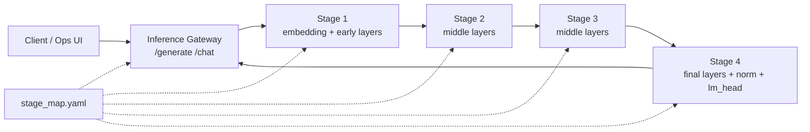

# Distributed Layer Inference

Distributed Layer Inference (DLI) is an experimental edge-inference system for
running transformer language models across multiple small Kubernetes nodes. The
project splits a model by layer, deploys each partition as an inference stage,
and routes token generation through a gateway that coordinates stage-to-stage
activation exchange.

The repository targets a Raspberry Pi / ARM64 K3s cluster, but the runtime code,
container images, Kubernetes manifests, and model-splitting tools are organized
so the same workflow can be adapted to other resource-constrained clusters.

## What This Project Does

- Splits causal language models into stage checkpoints or native GGUF shards.
- Runs a gateway service that owns tokenization, generation orchestration, and
  user-facing APIs.
- Runs stage services that execute assigned transformer layers and forward
  activations to the next stage.
- Supports two runtime tracks:
  - Python/FastAPI/PyTorch, used as the baseline and compatibility runtime.
  - Native C++/llama.cpp, used for the lower-overhead GGUF stage runtime.
- Deploys the full pipeline to K3s with one gateway and four stage nodes.
- Provides an operations UI for cluster health, logs, endpoint calls, chat, and
  runtime comparison.

## Architecture

At runtime, a request enters the gateway, is tokenized, and is sent through a
fixed stage chain. Each stage owns a slice of the transformer graph. Intermediate
stages return hidden states; the terminal stage owns the final normalization and
LM head and returns the next token.



The stage map is the main topology contract. It describes the model, stage IDs,
service names, physical node placement, layer ownership, next-stage URLs, and
runtime-specific artifact paths.

## Runtime Tracks

| Track | Main code | Artifact format | Transport | Kubernetes profile |
| --- | --- | --- | --- | --- |
| Python/PyTorch baseline | `src/python/dli/inference_gateway`, `src/python/dli/inference_stage` | `stage_N.pt` | JSON/base64 and binary activation payloads | `k8s/python` |
| Native C++/llama.cpp | `src/native/dli_gateway_cpp`, `src/native/dli_stage_cpp`, `src/native/dli_tools_cpp` | `partition-N.dli.gguf` | DLI2 binary tensor ABI over HTTP | `k8s/native` |

The Python path is useful for correctness, experimentation, and feature-module
work. The native path is designed to reduce Python and PyTorch overhead on edge
nodes and to support quantized GGUF shards.

## Cluster Topology

The documented reference cluster is a five-node K3s deployment on one wireless
subnet:

| Kubernetes node | Physical node | Role | IP | Workload role |
| --- | --- | --- | --- | --- |
| `k3s-master` | `pinode6` | control plane + etcd | `192.168.201.225` | gateway / orchestration |
| `pinode7` | `pinode7` | worker | `192.168.201.226` | stage 1 |
| `pinode8` | `pinode8` | worker | `192.168.201.227` | stage 2 |
| `pinode9` | `pinode9` | worker | `192.168.201.228` | stage 3 |
| `pinode10` | `pinode10` | worker | `192.168.201.229` | stage 4 |

The K3s API endpoint for this setup is:

```text
https://192.168.201.225:6443
```

Important operational assumptions from the cluster documentation:

- Every node must have a correct clock before installing K3s, otherwise TLS
  downloads can fail.
- `--node-ip` and `--advertise-address` must match the actual reachable IP of
  the host.
- Worker nodes must join with unique Kubernetes node names.
- Workers are labeled with `role=client`; the master is labeled with
  `role=master`.
- Inference workloads run in the `inference` namespace.
- Hugging Face tokens and K3s join tokens must be treated as secrets.

Detailed setup notes live in `documentation/`.

## Repository Structure

```text
.
|-- configs/                 # Stage maps and runtime configuration
|-- contracts/               # Native tensor ABI and GGUF shard contracts
|-- docker/                  # Python and native runtime Dockerfiles
|-- docs/                    # Design notes, plans, and experiment analysis
|-- documentation/           # K3s setup, topology, configuration, and fixes
|-- k8s/
|   |-- python/              # Python/PyTorch Kubernetes manifests
|   `-- native/              # Native C++/GGUF Kubernetes manifests
|-- ops-ui/                  # Local Node.js operations dashboard
|-- scripts/                 # Build, deploy, model split, and shard tools
|-- src/
|   |-- python/dli/          # Python gateway, stage runtime, benchmark tools
|   `-- native/              # C++ gateway, stage runtime, common code, tools
|-- tests/                   # Python tests
`-- results/                 # Experiment outputs and processed results
```

Generated model and build artifacts are intentionally kept out of Git:

- `models/`
- `build/`
- `.env`
- `.env.*`

## Quick Start

### 1. Create a Python environment

```bash
python -m venv .venv
source .venv/bin/activate
pip install -e .
```

This installs the Python package and its runtime dependencies from
`pyproject.toml`.

### 2. Split a Hugging Face model into Python stages

```bash
python -m dli.model_splitter.cli \
  --model-id TinyLlama/TinyLlama-1.1B-Chat-v1.0 \
  --num-stages 4 \
  --output-dir models/partitions/tinyllama-1.1b-chat/4-stage \
  --stage-map-file configs/stage_map.yaml \
  --physical-nodes pinode7 pinode8 pinode9 pinode10 \
  --dtype float32 \
  --device cpu \
  --force
```

The splitter writes:

```text
models/partitions/<model>/<split>/
|-- stage_1.pt
|-- stage_2.pt
|-- stage_3.pt
|-- stage_4.pt
|-- split_manifest.json
|-- tokenizer/
`-- config/
```

If the model is not already available under `models/hf/`, the splitter downloads
it from Hugging Face. Use `--local-model-dir` to point at an existing local copy.

### 3. Build native binaries locally

```bash
cmake -S src/native -B build/native -DCMAKE_BUILD_TYPE=Release
cmake --build build/native -j"$(nproc)"
ctest --test-dir build/native --output-on-failure
```

The native build produces:

- `dli-gateway-cpp`
- `dli-stage-cpp`
- `dli-partition-manifest`
- `dli-gguf-shard-writer`
- `dli-gguf-shard-validate`

### 4. Generate native GGUF stage shards

```bash
BUILD_DIR=build/native \
scripts/generate_native_shards.sh \
  configs/stage_map.native.latency_balanced_v1.yaml \
  models/gguf/tinyllama-1.1b-chat-v1.0.Q4_K_M.gguf \
  build/dli-native-shards
```

The native tools create partition manifests, write `.dli.gguf` shards, and
validate that every partition owns the expected tensor subset.

### 5. Build container images

```bash
scripts/build_images.sh
```

The image builder supports these services:

- `gateway-python`
- `stage-python`
- `native-gateway`
- `native-stage`
- `native-tools`

The script is interactive and can build multi-arch images through Docker Buildx.
Override defaults such as `DOCKERHUB_NAMESPACE`, `BUILDER`, and native CMake
settings from the shell when needed.

## Deploying to K3s

Prepare the cluster first:

```bash
kubectl get nodes -o wide
kubectl get nodes -L role
kubectl create namespace inference --dry-run=client -o yaml | kubectl apply -f -
```

If the manifests need to download model artifacts from Hugging Face, create the
secret in the `inference` namespace:

```bash
kubectl -n inference create secret generic hf-hub \
  --from-literal=HF_TOKEN="<your-hugging-face-token>"
```

Deploy the native profile:

```bash
kubectl apply -f k8s/native/namespace.yaml
kubectl apply -f k8s/native/persistent-volumes.yaml
kubectl apply -f k8s/native/configmap.yaml
kubectl apply -f k8s/native/services.yaml
kubectl apply -f k8s/native/deployments.yaml
```

The Python profile lives under `k8s/python/` and follows the same order:
namespace, storage, config, services, then deployments.

Check the rollout:

```bash
kubectl -n inference get pods -o wide
kubectl -n inference get svc
kubectl -n inference get deploy
```

The default NodePort gateway services are:

| Runtime | Service | NodePort |
| --- | --- | --- |
| Python/PyTorch | `inference-gateway` | `30080` |
| Native C++ | `inference-native-gateway` | `30081` |

Example gateway request:

```bash
curl -s http://192.168.201.225:30080/health

curl -s http://192.168.201.225:30080/generate \
  -H "Content-Type: application/json" \
  -d '{"prompt":"Explain distributed edge inference in one sentence.","max_new_tokens":32,"min_new_tokens":1}'
```

Use port `30081` when calling the native gateway profile.

## Operations UI

The `ops-ui` package provides a small local dashboard for topology, pod health,
logs, endpoint calls, chat, and metric timelines.

```bash
cd ops-ui
npm install
KUBECONFIG=/etc/rancher/k3s/k3s.yaml npm start
```

Open:

```text
http://localhost:4070
```

Useful environment variables:

| Variable | Default | Purpose |
| --- | --- | --- |
| `OPS_UI_PORT` | `4070` | Local UI port |
| `OPS_UI_NAMESPACE` | `inference` | Kubernetes namespace to inspect |
| `OPS_UI_RUNTIME_VARIANT` | `python` | Use `native` for C++/llama.cpp targets |
| `OPS_UI_KUBECTL_TIMEOUT_MS` | `15000` | Timeout for kubectl-backed calls |

## Development Workflow

1. Update `configs/stage_map.yaml` or the native stage map to describe the
   desired partition layout.
2. Generate model artifacts:
   - Python track: `stage_N.pt` files from `dli.model_splitter`.
   - Native track: `partition-N.dli.gguf` files from the native shard tools.
3. Build and publish the gateway and stage images with `scripts/build_images.sh`.
4. Update the Kubernetes config map, image tags, and artifact repository values.
5. Apply the relevant manifests from `k8s/python` or `k8s/native`.
6. Watch pods, logs, and endpoint behavior through `kubectl` or `ops-ui`.
7. Run benchmarks or collect experiment logs from `src/python/dli/benchmark` and
   `scripts/collect_experiment_logs.sh`.

## Configuration Notes

- `configs/stage_map.yaml` is the default Python/PyTorch partition map.
- `configs/stage_map.native.latency_balanced_v1.yaml` is a native GGUF-oriented
  partition map.
- `k8s/*/configmap.yaml` embeds runtime configuration consumed by the deployed
  services.
- Native `.dli.gguf` shards must preserve original GGUF tensor names and add
  DLI metadata under the `dli.*` namespace.
- The terminal partition is discovered by `dli.owns_lm_head=true` or an empty
  next-stage URL, not by assuming a fixed stage number.

## Testing

Run Python tests:

```bash
pytest
```

Run native tests:

```bash
cmake -S src/native -B build/native -DCMAKE_BUILD_TYPE=Debug
cmake --build build/native -j"$(nproc)"
ctest --test-dir build/native --output-on-failure
```

## Documentation Index

- `documentation/k3s-master-setup.md` - master-node installation notes and the
  final working K3s server command.
- `documentation/k3s-client-setup.md` - worker-node join flow and token handling.
- `documentation/k3s-cluster-topology.md` - physical and logical cluster layout.
- `documentation/k3s-cluster-configuration.md` - labels, namespace, metrics, and
  storage configuration.
- `documentation/errors/README.md` - disk-pressure cleanup and recovery playbook.
- `contracts/dli2_native_tensor_abi.md` - native tensor payload ABI.
- `contracts/dli_gguf_stage_shard_spec.md` - native GGUF stage-shard contract.
- `ops-ui/README.md` - operations UI details.

## Operational Safety

- Do not commit real K3s join tokens, Hugging Face tokens, kubeconfigs, `.env`
  files, or generated model artifacts.
- Rotate the K3s node token if it appears in logs, screenshots, notes, or chat.
- Inspect K3s disk usage before deleting runtime state; never delete
  `/var/lib/rancher/k3s/server` during containerd cache cleanup.
- Keep node labels and hostnames aligned with the Kubernetes manifests, because
  stage pods are scheduled to specific physical workers.
