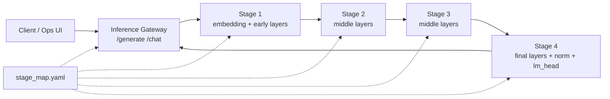

# Distributed Layer Inference

Distributed Layer Inference (DLI) is an experimental edge-inference system for
running transformer language models across multiple small Kubernetes nodes. The
project splits a model by layer, deploys each partition as an inference stage,
and routes token generation through a gateway that coordinates stage-to-stage
activation exchange.

The repository targets a Raspberry Pi / ARM64 K3s cluster, but the runtime code,
container images, Kubernetes manifests, and model-splitting tools are organized
so the same workflow can be adapted to other resource-constrained clusters.

## What This Project Does

- Splits causal language models into stage checkpoints or native GGUF shards.
- Runs a gateway service that owns tokenization, generation orchestration, and
  user-facing APIs.
- Runs stage services that execute assigned transformer layers and forward
  activations to the next stage.
- Supports two runtime tracks:
  - Python/FastAPI/PyTorch, used as the baseline and compatibility runtime.
  - Native C++/llama.cpp, used for the lower-overhead GGUF stage runtime.
- Deploys the full pipeline to K3s with one gateway and four stage nodes.
- Provides an operations UI for cluster health, logs, endpoint calls, chat, and
  runtime comparison.

## Architecture

At runtime, a request enters the gateway, is tokenized, and is sent through a
fixed stage chain. Each stage owns a slice of the transformer graph. Intermediate
stages return hidden states; the terminal stage owns the final normalization and
LM head and returns the next token.



The stage map is the main topology contract. It describes the model, stage IDs,
service names, physical node placement, layer ownership, next-stage URLs, and
runtime-specific artifact paths.

## Runtime Tracks

| Track | Main code | Artifact format | Transport | Kubernetes profile |
| --- | --- | --- | --- | --- |
| Python/PyTorch baseline | `src/python/dli/inference_gateway`, `src/python/dli/inference_stage` | `stage_N.pt` | JSON/base64 and binary activation payloads | `k8s/python` |
| Native C++/llama.cpp | `src/native/dli_gateway_cpp`, `src/native/dli_stage_cpp`, `src/native/dli_tools_cpp` | `partition-N.dli.gguf` | DLI2 binary tensor ABI over HTTP | `k8s/native` |

The Python path is useful for correctness, experimentation, and feature-module
work. The native path is designed to reduce Python and PyTorch overhead on edge
nodes and to support quantized GGUF shards.

## Cluster Topology

The documented reference cluster is a five-node K3s deployment on one wireless
subnet:

| Kubernetes node | Physical node | Role | IP | Workload role |
| --- | --- | --- | --- | --- |
| `k3s-master` | `pinode6` | control plane + etcd | `192.168.201.225` | gateway / orchestration |
| `pinode7` | `pinode7` | worker | `192.168.201.226` | stage 1 |
| `pinode8` | `pinode8` | worker | `192.168.201.227` | stage 2 |
| `pinode9` | `pinode9` | worker | `192.168.201.228` | stage 3 |
| `pinode10` | `pinode10` | worker | `192.168.201.229` | stage 4 |

The K3s API endpoint for this setup is:

```text
https://192.168.201.225:6443
```

Important operational assumptions from the cluster documentation:

- Every node must have a correct clock before installing K3s, otherwise TLS
  downloads can fail.
- `--node-ip` and `--advertise-address` must match the actual reachable IP of
  the host.
- Worker nodes must join with unique Kubernetes node names.
- Workers are labeled with `role=client`; the master is labeled with
  `role=master`.
- Inference workloads run in the `inference` namespace.
- Hugging Face tokens and K3s join tokens must be treated as secrets.

Detailed setup notes live in `documentation/`.

## Repository Structure

```text
.
|-- configs/                 # Stage maps and runtime configuration
|-- contracts/               # Native tensor ABI and GGUF shard contracts
|-- docker/                  # Python and native runtime Dockerfiles
|-- docs/                    # Design notes, plans, and experiment analysis
|-- documentation/           # K3s setup, topology, configuration, and fixes
|-- k8s/
|   |-- python/              # Python/PyTorch Kubernetes manifests
|   `-- native/              # Native C++/GGUF Kubernetes manifests
|-- ops-ui/                  # Local Node.js operations dashboard
|-- scripts/                 # Build, deploy, model split, and shard tools
|-- src/
|   |-- python/dli/          # Python gateway, stage runtime, benchmark tools
|   `-- native/              # C++ gateway, stage runtime, common code, tools
|-- tests/                   # Python tests
`-- results/                 # Experiment outputs and processed results
```

Generated model and build artifacts are intentionally kept out of Git:

- `models/`
- `build/`
- `.env`
- `.env.*`

## Quick Start

### 1. Create a Python environment

```bash
python -m venv .venv
source .venv/bin/activate
pip install -e .
```

This installs the Python package and its runtime dependencies from
`pyproject.toml`.

### 2. Split a Hugging Face model into Python stages

```bash
python -m dli.model_splitter.cli \
  --model-id TinyLlama/TinyLlama-1.1B-Chat-v1.0 \
  --num-stages 4 \
  --output-dir models/partitions/tinyllama-1.1b-chat/4-stage \
  --stage-map-file configs/stage_map.yaml \
  --physical-nodes pinode7 pinode8 pinode9 pinode10 \
  --dtype float32 \
  --device cpu \
  --force
```

The splitter writes:

```text
models/partitions/<model>/<split>/
|-- stage_1.pt
|-- stage_2.pt
|-- stage_3.pt
|-- stage_4.pt
|-- split_manifest.json
|-- tokenizer/
`-- config/
```

If the model is not already available under `models/hf/`, the splitter downloads
it from Hugging Face. Use `--local-model-dir` to point at an existing local copy.

### 3. Build native binaries locally

```bash
cmake -S src/native -B build/native -DCMAKE_BUILD_TYPE=Release
cmake --build build/native -j"$(nproc)"
ctest --test-dir build/native --output-on-failure
```

The native build produces:

- `dli-gateway-cpp`
- `dli-stage-cpp`
- `dli-partition-manifest`
- `dli-gguf-shard-writer`
- `dli-gguf-shard-validate`

### 4. Generate native GGUF stage shards

```bash
BUILD_DIR=build/native \
scripts/generate_native_shards.sh \
  configs/stage_map.native.latency_balanced_v1.yaml \
  models/gguf/tinyllama-1.1b-chat-v1.0.Q4_K_M.gguf \
  build/dli-native-shards
```

The native tools create partition manifests, write `.dli.gguf` shards, and
validate that every partition owns the expected tensor subset.

### 5. Upload native shards to Hugging Face Hub

The native Kubernetes profile downloads model artifacts from Hugging Face during
pod startup. Each stage init container downloads one file named
`partition-${STAGE_ID}.dli.gguf`; the native gateway init container downloads
the full GGUF file used for tokenizer/model metadata.

Install and authenticate the current Hugging Face CLI:

```bash
curl -LsSf https://hf.co/cli/install.sh | bash -s
hf auth login
hf auth whoami
```

Create a model repository for the native artifacts:

```bash
HF_REPO="your-user-or-org/dli-tinyllama-native-gguf-4stage"

hf repos create "${HF_REPO}" \
  --type model \
  --private \
  --exist-ok
```

Upload the generated stage shards at the repository root:

```bash
hf upload "${HF_REPO}" \
  build/dli-native-shards/shards \
  . \
  --type model \
  --include "partition-*.dli.gguf" \
  --commit-message "Upload DLI native stage shards"
```

Upload the full GGUF file expected by the native gateway:

```bash
hf upload "${HF_REPO}" \
  models/gguf/tinyllama-1.1b-chat-v1.0.Q4_K_M.gguf \
  tinyllama-1.1b-chat-v1.0.Q4_K_M.gguf \
  --type model \
  --commit-message "Upload native gateway GGUF"
```

For very large or unreliable uploads, use the resumable command instead:

```bash
hf upload-large-folder "${HF_REPO}" \
  build/dli-native-shards/shards \
  --type model \
  --include "partition-*.dli.gguf"
```

After upload, the Hugging Face repository should contain:

```text
partition-1.dli.gguf
partition-2.dli.gguf
partition-3.dli.gguf
partition-4.dli.gguf
tinyllama-1.1b-chat-v1.0.Q4_K_M.gguf
```

Configure `k8s/native/configmap.yaml` to point at that repository:

```yaml
data:
  HF_NATIVE_STAGE_REPO: "your-user-or-org/dli-tinyllama-native-gguf-4stage"
  HF_NATIVE_STAGE_REVISION: "main"

  HF_NATIVE_FULL_GGUF_REPO: "your-user-or-org/dli-tinyllama-native-gguf-4stage"
  HF_NATIVE_FULL_GGUF_REVISION: "main"
  HF_NATIVE_FULL_GGUF_FILE: "tinyllama-1.1b-chat-v1.0.Q4_K_M.gguf"
```

Use an immutable tag or commit SHA instead of `main` for reproducible cluster
runs. If the repository is private, create the Kubernetes secret before applying
the native deployments:

```bash
kubectl -n inference create secret generic hf-hub \
  --from-literal=HF_TOKEN="<hugging-face-read-token>" \
  --dry-run=client -o yaml | kubectl apply -f -
```

### 6. Build container images

```bash
scripts/build_images.sh
```

`scripts/build_images.sh` is the main image build and publish helper. It is an
interactive wrapper around Docker Buildx that selects the right Dockerfile,
build target, tag layout, cache settings, and multi-architecture manifest for
each DLI service.

The image builder supports these service choices:

- `gateway-python`
- `stage-python`
- `native-gateway`
- `native-stage`
- `native-tools`

The script asks for:

- service to build;
- target image repository;
- optional existing image tag to use as a base image or build cache;
- new release tag;
- target platform: `amd64`, `arm64`, or both;
- confirmation before local builds;
- confirmation before pushing architecture images and the multi-arch manifest;
- optional local cleanup after push.

Default Docker Hub repositories are derived from `DOCKERHUB_NAMESPACE`:

| Service | Default repository | Dockerfile / target |
| --- | --- | --- |
| `gateway-python` | `<namespace>/distributed-layer-inference-gateway-python` | `docker/Dockerfile.gateway-python` |
| `stage-python` | `<namespace>/distributed-layer-inference-stage-python` | `docker/Dockerfile.stage-python` |
| `native-gateway` | `<namespace>/distributed-layer-inference-native-gateway` | `docker/Dockerfile.native`, target `gateway-runtime` |
| `native-stage` | `<namespace>/distributed-layer-inference-native-stage` | `docker/Dockerfile.native`, target `stage-runtime` |
| `native-tools` | `<namespace>/distributed-layer-inference-native-tools` | `docker/Dockerfile.native`, target `tools-runtime` |

Example: build and push the native stage image for the ARM64 K3s nodes:

```bash
DOCKERHUB_NAMESPACE=yourdockerhub \
BUILDER=multiarch-insecure \
NATIVE_CMAKE_BUILD_TYPE=Release \
NATIVE_GGML_NATIVE=OFF \
NATIVE_GGML_CPU_ARM_ARCH=armv8-a \
scripts/build_images.sh
```

When prompted, use:

```text
Service to build: native-stage
Image repo: <press Enter for default or enter your repo>
Base image tag number or tag: <press Enter for Dockerfile default>
New tag: v2026-05-25-native-stage
Choice (1/2/3): 3
Ready to build local image(s) for linux/arm64? y
Push arch image(s) to ...? y
Cleanup local images and dangling layers? y
```

Example: build both native runtime images needed by `k8s/native`:

```bash
DOCKERHUB_NAMESPACE=yourdockerhub scripts/build_images.sh
# choose: native-stage

DOCKERHUB_NAMESPACE=yourdockerhub scripts/build_images.sh
# choose: native-gateway
```

Example: build the Python baseline images used by `k8s/python`:

```bash
DOCKERHUB_NAMESPACE=yourdockerhub scripts/build_images.sh
# choose: gateway-python

DOCKERHUB_NAMESPACE=yourdockerhub scripts/build_images.sh
# choose: stage-python
```

Example: build only local images without pushing:

```bash
DOCKERHUB_NAMESPACE=yourdockerhub scripts/build_images.sh
```

Answer `n` at the push prompt. The script leaves local tags such as
`<repo>:arm64-local` or `<repo>:amd64-local` unless cleanup is selected.

Common environment overrides:

| Variable | Default | Purpose |
| --- | --- | --- |
| `DOCKERHUB_NAMESPACE` | `mipeda150` | Namespace used for default image repositories |
| `BUILDER` | `multiarch-insecure` | Docker Buildx builder name |
| `PIP_INDEX_URL` | `https://pypi.org/simple` | Python package index for Python images |
| `NATIVE_CMAKE_BUILD_TYPE` | `Release` | CMake build type for native images |
| `NATIVE_GGML_NATIVE` | `OFF` | Avoid host-specific CPU flags in portable native images |
| `NATIVE_GGML_CPU_ARM_ARCH` | `armv8-a` | ARM CPU target used for native ARM64 builds |
| `ENABLE_REGISTRY_CACHE` | `1` | Publish and reuse registry build caches |

After publishing new tags, update the image references in `k8s/python/*.yaml`
or `k8s/native/deployments.yaml` before applying the manifests.

## Deploying to K3s

Prepare the cluster first:

```bash
kubectl get nodes -o wide
kubectl get nodes -L role
kubectl create namespace inference --dry-run=client -o yaml | kubectl apply -f -
```

If the manifests need to download model artifacts from Hugging Face, create the
secret in the `inference` namespace:

```bash
kubectl -n inference create secret generic hf-hub \
  --from-literal=HF_TOKEN="<your-hugging-face-token>"
```

Deploy the native profile:

```bash
kubectl apply -f k8s/native/namespace.yaml
kubectl apply -f k8s/native/persistent-volumes.yaml
kubectl apply -f k8s/native/configmap.yaml
kubectl apply -f k8s/native/services.yaml
kubectl apply -f k8s/native/deployments.yaml
```

The Python profile lives under `k8s/python/` and follows the same order:
namespace, storage, config, services, then deployments.

Check the rollout:

```bash
kubectl -n inference get pods -o wide
kubectl -n inference get svc
kubectl -n inference get deploy
```

The default NodePort gateway services are:

| Runtime | Service | NodePort |
| --- | --- | --- |
| Python/PyTorch | `inference-gateway` | `30080` |
| Native C++ | `inference-native-gateway` | `30081` |

Example gateway request:

```bash
curl -s http://192.168.201.225:30080/health

curl -s http://192.168.201.225:30080/generate \
  -H "Content-Type: application/json" \
  -d '{"prompt":"Explain distributed edge inference in one sentence.","max_new_tokens":32,"min_new_tokens":1}'
```

Use port `30081` when calling the native gateway profile.

## Operations UI

The `ops-ui` package provides a small local dashboard for topology, pod health,
logs, endpoint calls, chat, and metric timelines.

```bash
cd ops-ui
npm install
KUBECONFIG=/etc/rancher/k3s/k3s.yaml npm start
```

Open:

```text
http://localhost:4070
```

Useful environment variables:

| Variable | Default | Purpose |
| --- | --- | --- |
| `OPS_UI_PORT` | `4070` | Local UI port |
| `OPS_UI_NAMESPACE` | `inference` | Kubernetes namespace to inspect |
| `OPS_UI_RUNTIME_VARIANT` | `python` | Use `native` for C++/llama.cpp targets |
| `OPS_UI_KUBECTL_TIMEOUT_MS` | `15000` | Timeout for kubectl-backed calls |

## Development Workflow

The repository has two development tracks. Keep them separate when changing a
runtime, because they use different model artifact formats, image repositories,
and Kubernetes manifests.

### Python/PyTorch Track

Use this track for baseline behavior, feature-module experimentation, and
correctness comparisons.

1. Edit `configs/stage_map.yaml` when changing layer ownership, physical node
   placement, service names, or route candidates.
2. Generate or refresh `stage_N.pt` files with `dli.model_splitter`.
3. Upload the generated Python partitions to the Hugging Face repository used by
   the Python init containers, or make them available through the mounted model
   volume used in your deployment.
4. Build and publish:
   - `gateway-python`
   - `stage-python`
5. Update Python image tags and artifact repository values in `k8s/python/`.
6. Apply the Python manifests and verify:

```bash
kubectl apply -f k8s/python/namespace.yaml
kubectl apply -f k8s/python/configmap.yaml
kubectl apply -f k8s/python/inference-gateway-service.yaml
kubectl apply -f k8s/python/inference-stage-1-service.yaml
kubectl apply -f k8s/python/inference-stage-2-service.yaml
kubectl apply -f k8s/python/inference-stage-3-service.yaml
kubectl apply -f k8s/python/inference-stage-4-service.yaml
kubectl apply -f k8s/python/inference-gateway-deployment.yaml
kubectl apply -f k8s/python/inference-stage-1-deployment.yaml
kubectl apply -f k8s/python/inference-stage-2-deployment.yaml
kubectl apply -f k8s/python/inference-stage-3-deployment.yaml
kubectl apply -f k8s/python/inference-stage-4-deployment.yaml
kubectl -n inference get pods -o wide
```

The Python gateway is exposed through `inference-gateway` on NodePort `30080`.

### Native C++/GGUF Track

Use this track for the llama.cpp runtime, DLI2 binary tensor transport, and
quantized `.dli.gguf` partition shards.

1. Edit `configs/stage_map.native.latency_balanced_v1.yaml` when changing native
   layer ownership, service names, node placement, or binary stage routes.
2. Build the native tools:

```bash
cmake -S src/native -B build/native -DCMAKE_BUILD_TYPE=Release
cmake --build build/native -j"$(nproc)"
```

3. Generate and validate native artifacts:

```bash
BUILD_DIR=build/native \
scripts/generate_native_shards.sh \
  configs/stage_map.native.latency_balanced_v1.yaml \
  models/gguf/tinyllama-1.1b-chat-v1.0.Q4_K_M.gguf \
  build/dli-native-shards
```

4. Upload `partition-N.dli.gguf` shards and the full gateway GGUF to Hugging
   Face Hub.
5. Update `k8s/native/configmap.yaml`:
   - `HF_NATIVE_STAGE_REPO`
   - `HF_NATIVE_STAGE_REVISION`
   - `HF_NATIVE_FULL_GGUF_REPO`
   - `HF_NATIVE_FULL_GGUF_REVISION`
   - `HF_NATIVE_FULL_GGUF_FILE`
   - embedded `stage_map.yaml` if the partition layout changed
6. Build and publish:
   - `native-stage`
   - `native-gateway`
   - `native-tools` when shard generation/validation should run in a container
7. Update image tags in `k8s/native/deployments.yaml`.
8. Apply the native manifests and verify:

```bash
kubectl apply -f k8s/native/namespace.yaml
kubectl apply -f k8s/native/persistent-volumes.yaml
kubectl apply -f k8s/native/configmap.yaml
kubectl apply -f k8s/native/services.yaml
kubectl apply -f k8s/native/deployments.yaml
kubectl -n inference get pods -o wide
```

The native gateway is exposed through `inference-native-gateway` on NodePort
`30081`.

For either track, watch pods, inspect logs, and test endpoints through `kubectl`
or `ops-ui`. Benchmark and experiment utilities live under
`src/python/dli/benchmark` and `scripts/collect_experiment_logs.sh`.

## Configuration Notes

- `configs/stage_map.yaml` is the default Python/PyTorch partition map.
- `configs/stage_map.native.latency_balanced_v1.yaml` is a native GGUF-oriented
  partition map.
- `k8s/*/configmap.yaml` embeds runtime configuration consumed by the deployed
  services.
- Native `.dli.gguf` shards must preserve original GGUF tensor names and add
  DLI metadata under the `dli.*` namespace.
- The terminal partition is discovered by `dli.owns_lm_head=true` or an empty
  next-stage URL, not by assuming a fixed stage number.

## Testing

Run Python tests:

```bash
pytest
```

Run native tests:

```bash
cmake -S src/native -B build/native -DCMAKE_BUILD_TYPE=Debug
cmake --build build/native -j"$(nproc)"
ctest --test-dir build/native --output-on-failure
```

## Documentation Index

- `documentation/k3s-master-setup.md` - master-node installation notes and the
  final working K3s server command.
- `documentation/k3s-client-setup.md` - worker-node join flow and token handling.
- `documentation/k3s-cluster-topology.md` - physical and logical cluster layout.
- `documentation/k3s-cluster-configuration.md` - labels, namespace, metrics, and
  storage configuration.
- `documentation/errors/README.md` - disk-pressure cleanup and recovery playbook.
- `contracts/dli2_native_tensor_abi.md` - native tensor payload ABI.
- `contracts/dli_gguf_stage_shard_spec.md` - native GGUF stage-shard contract.
- `ops-ui/README.md` - operations UI details.

## Operational Safety

- Do not commit real K3s join tokens, Hugging Face tokens, kubeconfigs, `.env`
  files, or generated model artifacts.
- Rotate the K3s node token if it appears in logs, screenshots, notes, or chat.
- Inspect K3s disk usage before deleting runtime state; never delete
  `/var/lib/rancher/k3s/server` during containerd cache cleanup.
- Keep node labels and hostnames aligned with the Kubernetes manifests, because
  stage pods are scheduled to specific physical workers.
