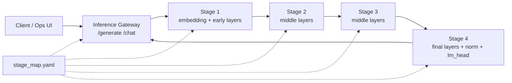

# Distributed Layer Inference

Distributed Layer Inference (DLI) is an experimental edge-inference system for
running transformer language models across multiple small Kubernetes nodes. The
project splits a model by layer, deploys each partition as an inference stage,
and routes token generation through a gateway that coordinates stage-to-stage
activation exchange.

The repository targets a Raspberry Pi / ARM64 K3s cluster, but the runtime code,
container images, Kubernetes manifests, and model-splitting tools are organized
so the same workflow can be adapted to other resource-constrained clusters.

## What This Project Does

- Splits causal language models into stage checkpoints or native GGUF shards.
- Runs a gateway service that owns tokenization, generation orchestration, and
  user-facing APIs.
- Runs stage services that execute assigned transformer layers and forward
  activations to the next stage.
- Supports two runtime tracks:
  - Python/FastAPI/PyTorch, used as the baseline and compatibility runtime.
  - Native C++/llama.cpp, used for the lower-overhead GGUF stage runtime.
- Deploys the full pipeline to K3s with one gateway and four stage nodes.
- Provides an operations UI for cluster health, logs, endpoint calls, chat, and
  runtime comparison.

## Architecture

At runtime, a request enters the gateway, is tokenized, and is sent through a
fixed stage chain. Each stage owns a slice of the transformer graph. Intermediate
stages return hidden states; the terminal stage owns the final normalization and
LM head and returns the next token.



The stage map is the main topology contract. It describes the model, stage IDs,
service names, physical node placement, layer ownership, next-stage URLs, and
runtime-specific artifact paths.

## Runtime Tracks

| Track | Main code | Artifact format | Transport | Kubernetes profile |
| --- | --- | --- | --- | --- |
| Python/PyTorch baseline | `src/python/dli/inference_gateway`, `src/python/dli/inference_stage` | `stage_N.pt` | JSON/base64 and binary activation payloads | `k8s/python` |
| Native C++/llama.cpp | `src/native/dli_gateway_cpp`, `src/native/dli_stage_cpp`, `src/native/dli_tools_cpp` | `partition-N.dli.gguf` | DLI2 binary tensor ABI over HTTP | `k8s/native` |

The Python path is useful for correctness, experimentation, and feature-module
work. The native path is designed to reduce Python and PyTorch overhead on edge
nodes and to support quantized GGUF shards.

## Cluster Topology

The documented reference cluster is a five-node K3s deployment on one wireless
subnet:

| Kubernetes node | Physical node | Role | IP | Workload role |
| --- | --- | --- | --- | --- |
| `dli-control-plane` | `dli-control-plane-host` | control plane + etcd | `<CONTROL_PLANE_IP>` | gateway / orchestration |
| `dli-worker-1` | `dli-worker-1` | worker | `<WORKER_1_IP>` | stage 1 |
| `dli-worker-2` | `dli-worker-2` | worker | `<WORKER_2_IP>` | stage 2 |
| `dli-worker-3` | `dli-worker-3` | worker | `<WORKER_3_IP>` | stage 3 |
| `dli-worker-4` | `dli-worker-4` | worker | `<WORKER_4_IP>` | stage 4 |

The K3s API endpoint for this setup is:

```text
https://<CONTROL_PLANE_IP>:6443
```

Replace the placeholder node names and addresses with your own cluster values
before applying manifests or running the setup commands.

Important operational assumptions from the cluster documentation:

- Every node must have a correct clock before installing K3s, otherwise TLS
  downloads can fail.
- `--node-ip` and `--advertise-address` must match the actual reachable IP of
  the host.
- Worker nodes must join with unique Kubernetes node names.
- Workers are labeled with `role=client`; the master is labeled with
  `role=master`.
- Inference workloads run in the `inference` namespace.
- Hugging Face tokens and K3s join tokens must be treated as secrets.

Detailed setup notes live in `documentation/`.

## Repository Structure

```text
.
|-- configs/                 # Stage maps and runtime configuration
|-- contracts/               # Native tensor ABI and GGUF shard contracts
|-- docker/                  # Python and native runtime Dockerfiles
|-- docs/                    # Design notes, plans, and experiment analysis
|-- documentation/           # K3s setup, topology, configuration, and fixes
|-- k8s/
|   |-- python/              # Python/PyTorch Kubernetes manifests
|   `-- native/              # Native C++/GGUF Kubernetes manifests
|-- ops-ui/                  # Local Node.js operations dashboard
|-- scripts/                 # Build, deploy, model split, and shard tools
|-- src/
|   |-- python/dli/          # Python gateway, stage runtime, benchmark tools
|   `-- native/              # C++ gateway, stage runtime, common code, tools
|-- tests/                   # Python tests
`-- results/                 # Experiment outputs and processed results
```

Generated model and build artifacts are intentionally kept out of Git:

- `models/`
- `build/`
- `.env`
- `.env.*`

## Quick Start

### 1. Create a Python environment

```bash
python -m venv .venv
source .venv/bin/activate
pip install -e .
```

This installs the Python package and its runtime dependencies from
`pyproject.toml`.

### 2. Split a Hugging Face model into Python stages

```bash
python -m dli.model_splitter.cli \
  --model-id TinyLlama/TinyLlama-1.1B-Chat-v1.0 \
  --num-stages 4 \
  --output-dir models/partitions/tinyllama-1.1b-chat/4-stage \
  --stage-map-file configs/stage_map.yaml \
  --physical-nodes dli-worker-1 dli-worker-2 dli-worker-3 dli-worker-4 \
  --dtype float32 \
  --device cpu \
  --force
```

The splitter writes:

```text
models/partitions/<model>/<split>/
|-- stage_1.pt
|-- stage_2.pt
|-- stage_3.pt
|-- stage_4.pt
|-- split_manifest.json
|-- tokenizer/
`-- config/
```

If the model is not already available under `models/hf/`, the splitter downloads
it from Hugging Face. Use `--local-model-dir` to point at an existing local copy.

### 3. Build native binaries locally

```bash
cmake -S src/native -B build/native -DCMAKE_BUILD_TYPE=Release
cmake --build build/native -j"$(nproc)"
ctest --test-dir build/native --output-on-failure
```

The native build produces:

- `dli-gateway-cpp`
- `dli-stage-cpp`
- `dli-partition-manifest`
- `dli-gguf-shard-writer`
- `dli-gguf-shard-validate`
- `dli-gguf-info`
- `dli-native-model-controller`

### 4. Generate native GGUF stage shards

```bash
BUILD_DIR=build/native \
scripts/generate_native_shards.sh \
  configs/stage_map.native.latency_balanced_v1.yaml \
  models/gguf/tinyllama-1.1b-chat-v1.0.Q4_K_M.gguf \
  build/dli-native-shards
```

The native tools create partition manifests, write `.dli.gguf` shards, validate
that every partition owns the expected tensor subset, and can run the C++
`dli-native-model-controller` used by `ops-ui` prep Jobs.

### 5. Upload native shards to Hugging Face Hub

The native Kubernetes profile downloads model-scoped artifacts from Hugging
Face during pod startup. Each stage init container downloads
`<model-slug>/partition-${STAGE_ID}.dli.gguf`; the native gateway init container
downloads the full GGUF file used for tokenizer/model metadata.

The preferred dynamic path is the `ops-ui` Native Model Controller panel. It
starts a Kubernetes prep Job using the native tools image and the compiled C++
`dli-native-model-controller` binary. That Job downloads the full GGUF,
generates `stage_map.yaml`, creates and validates shards, uploads artifacts to
Hugging Face with `git-lfs`, and emits the activation payload used by `ops-ui`.

Install and authenticate the current Hugging Face CLI:

```bash
curl -LsSf https://hf.co/cli/install.sh | bash -s
hf auth login
hf auth whoami
```

Create a model repository for the native artifacts:

```bash
HF_REPO="your-user-or-org/dli-tinyllama-native-gguf-4stage"

hf repos create "${HF_REPO}" \
  --type model \
  --private \
  --exist-ok
```

Upload the generated stage shards into the model slug directory:

```bash
MODEL_SLUG="tinyllama-1.1b-chat-v1.0-q4_k_m"

hf upload "${HF_REPO}" \
  build/dli-native-shards/shards \
  "${MODEL_SLUG}" \
  --type model \
  --include "partition-*.dli.gguf" \
  --commit-message "Upload DLI native stage shards"
```

Upload the full GGUF file expected by the native gateway:

```bash
hf upload "${HF_REPO}" \
  models/gguf/tinyllama-1.1b-chat-v1.0.Q4_K_M.gguf \
  "${MODEL_SLUG}/tinyllama-1.1b-chat-v1.0.Q4_K_M.gguf" \
  --type model \
  --commit-message "Upload native gateway GGUF"
```

For very large or unreliable uploads, use the resumable command instead:

```bash
mkdir -p "build/dli-native-upload/${MODEL_SLUG}"
cp build/dli-native-shards/shards/partition-*.dli.gguf "build/dli-native-upload/${MODEL_SLUG}/"
cp models/gguf/tinyllama-1.1b-chat-v1.0.Q4_K_M.gguf "build/dli-native-upload/${MODEL_SLUG}/"

hf upload-large-folder "${HF_REPO}" \
  build/dli-native-upload \
  --type model
```

The minimum Hugging Face repository contents are:

```text
tinyllama-1.1b-chat-v1.0-q4_k_m/partition-1.dli.gguf
tinyllama-1.1b-chat-v1.0-q4_k_m/partition-2.dli.gguf
tinyllama-1.1b-chat-v1.0-q4_k_m/partition-3.dli.gguf
tinyllama-1.1b-chat-v1.0-q4_k_m/partition-4.dli.gguf
tinyllama-1.1b-chat-v1.0-q4_k_m/tinyllama-1.1b-chat-v1.0.Q4_K_M.gguf
```

The C++ prep controller also uploads `<model-slug>/stage_map.yaml` and
`<model-slug>/native-model.json` for auditability.

Configure `k8s/native/configmap.yaml` to point at that repository:

```yaml
data:
  HF_NATIVE_STAGE_REPO: "your-user-or-org/dli-tinyllama-native-gguf-4stage"
  HF_NATIVE_STAGE_REVISION: "main"

  HF_NATIVE_FULL_GGUF_REPO: "your-user-or-org/dli-tinyllama-native-gguf-4stage"
  HF_NATIVE_FULL_GGUF_REVISION: "main"
  HF_NATIVE_FULL_GGUF_FILE: "tinyllama-1.1b-chat-v1.0-q4_k_m/tinyllama-1.1b-chat-v1.0.Q4_K_M.gguf"
```

Use an immutable tag or commit SHA instead of `main` for reproducible cluster
runs. If the repository is private, create the Kubernetes secret before applying
the native deployments:

```bash
kubectl -n inference create secret generic hf-hub \
  --from-literal=HF_TOKEN="<hugging-face-read-token>" \
  --from-literal=HF_UPLOAD_TOKEN="<hugging-face-write-token>" \
  --dry-run=client -o yaml | kubectl apply -f -
```

### 6. Build container images

```bash
scripts/build_images.sh
```

`scripts/build_images.sh` is the main image build and publish helper. It is an
interactive wrapper around Docker Buildx that selects the right Dockerfile,
build target, tag layout, cache settings, and multi-architecture manifest for
each DLI service.

The image builder supports these service choices:

- `gateway-python`
- `stage-python`
- `native-gateway`
- `native-stage`
- `native-tools`

The script asks for:

- service to build;
- target image repository;
- optional existing image tag to use as a base image or build cache;
- new release tag;
- target platform: `amd64`, `arm64`, or both;
- confirmation before local builds;
- confirmation before pushing architecture images and the multi-arch manifest;
- optional local cleanup after push.

Default Docker Hub repositories are derived from `DOCKERHUB_NAMESPACE`:

| Service | Default repository | Dockerfile / target |
| --- | --- | --- |
| `gateway-python` | `<namespace>/distributed-layer-inference-gateway-python` | `docker/Dockerfile.gateway-python` |
| `stage-python` | `<namespace>/distributed-layer-inference-stage-python` | `docker/Dockerfile.stage-python` |
| `native-gateway` | `<namespace>/distributed-layer-inference-native-gateway` | `docker/Dockerfile.native`, target `gateway-runtime` |
| `native-stage` | `<namespace>/distributed-layer-inference-native-stage` | `docker/Dockerfile.native`, target `stage-runtime` |
| `native-tools` | `<namespace>/distributed-layer-inference-native-tools` | `docker/Dockerfile.native`, target `tools-runtime` |

Example: build and push the native stage image for the ARM64 K3s nodes:

```bash
DOCKERHUB_NAMESPACE=yourdockerhub \
BUILDER=multiarch-insecure \
NATIVE_CMAKE_BUILD_TYPE=Release \
NATIVE_GGML_NATIVE=OFF \
NATIVE_GGML_CPU_ARM_ARCH=armv8-a \
scripts/build_images.sh
```

When prompted, use:

```text
Service to build: native-stage
Image repo: <press Enter for default or enter your repo>
Base image tag number or tag: <press Enter for Dockerfile default>
New tag: v2026-05-25-native-stage
Choice (1/2/3): 3
Ready to build local image(s) for linux/arm64? y
Push arch image(s) to ...? y
Cleanup local images and dangling layers? y
```

Example: build both native runtime images needed by `k8s/native`:

```bash
DOCKERHUB_NAMESPACE=yourdockerhub scripts/build_images.sh
# choose: native-stage

DOCKERHUB_NAMESPACE=yourdockerhub scripts/build_images.sh
# choose: native-gateway
```

Example: build the Python baseline images used by `k8s/python`:

```bash
DOCKERHUB_NAMESPACE=yourdockerhub scripts/build_images.sh
# choose: gateway-python

DOCKERHUB_NAMESPACE=yourdockerhub scripts/build_images.sh
# choose: stage-python
```

Example: build only local images without pushing:

```bash
DOCKERHUB_NAMESPACE=yourdockerhub scripts/build_images.sh
```

Answer `n` at the push prompt. The script leaves local tags such as
`<repo>:arm64-local` or `<repo>:amd64-local` unless cleanup is selected.

Common environment overrides:

| Variable | Default | Purpose |
| --- | --- | --- |
| `DOCKERHUB_NAMESPACE` | `mipeda150` | Namespace used for default image repositories |
| `BUILDER` | `multiarch-insecure` | Docker Buildx builder name |
| `PIP_INDEX_URL` | `https://pypi.org/simple` | Python package index for Python images |
| `NATIVE_CMAKE_BUILD_TYPE` | `Release` | CMake build type for native images |
| `NATIVE_GGML_NATIVE` | `OFF` | Avoid host-specific CPU flags in portable native images |
| `NATIVE_GGML_CPU_ARM_ARCH` | `armv8-a` | ARM CPU target used for native ARM64 builds |
| `ENABLE_REGISTRY_CACHE` | `1` | Publish and reuse registry build caches |

After publishing new tags, update the image references in `k8s/python/*.yaml`
or `k8s/native/deployments.yaml` before applying the manifests.

## Deploying to K3s

Prepare the cluster first:

```bash
kubectl get nodes -o wide
kubectl get nodes -L role
kubectl create namespace inference --dry-run=client -o yaml | kubectl apply -f -
```

If the manifests need to download model artifacts from Hugging Face, create the
secret in the `inference` namespace:

```bash
kubectl -n inference create secret generic hf-hub \
  --from-literal=HF_TOKEN="<your-hugging-face-read-token>" \
  --from-literal=HF_UPLOAD_TOKEN="<your-hugging-face-write-token>"
```

Deploy the native profile:

```bash
kubectl apply -f k8s/native/namespace.yaml
kubectl apply -f k8s/native/persistent-volumes.yaml
kubectl apply -f k8s/native/configmap.yaml
kubectl apply -f k8s/native/services.yaml
kubectl apply -f k8s/native/deployments.yaml
```

The Python profile lives under `k8s/python/` and follows the same order:
namespace, storage, config, services, then deployments.

Check the rollout:

```bash
kubectl -n inference get pods -o wide
kubectl -n inference get svc
kubectl -n inference get deploy
```

The default NodePort gateway services are:

| Runtime | Service | NodePort |
| --- | --- | --- |
| Python/PyTorch | `inference-gateway` | `30080` |
| Native C++ | `inference-native-gateway` | `30081` |

Example gateway request:

```bash
curl -s http://<CONTROL_PLANE_IP>:30080/health

curl -s http://<CONTROL_PLANE_IP>:30080/generate \
  -H "Content-Type: application/json" \
  -d '{"prompt":"Explain distributed edge inference in one sentence.","max_new_tokens":32,"min_new_tokens":1}'
```

Use port `30081` when calling the native gateway profile.

## Operations UI

The `ops-ui` package provides a small local dashboard for pod health, workload
state, logs, endpoint calls, chat, and metric timelines.

```bash
cd ops-ui
npm install
KUBECONFIG=/etc/rancher/k3s/k3s.yaml npm start
```

Open:

```text
http://localhost:4070
```

Useful environment variables:

| Variable | Default | Purpose |
| --- | --- | --- |
| `OPS_UI_PORT` | `4070` | Local UI port |
| `OPS_UI_NAMESPACE` | `inference` | Kubernetes namespace to inspect |
| `OPS_UI_RUNTIME_VARIANT` | `python` | Use `native` for C++/llama.cpp targets |
| `OPS_UI_KUBECTL_TIMEOUT_MS` | `15000` | Timeout for kubectl-backed calls |
| `OPS_UI_HISTORY_MAX_ENTRIES` | `4000` | Maximum stored endpoint/chat metric runs |

### Using the Ops UI

The Ops UI has two pages:

- Dashboard: `http://localhost:4070/index.html`
- History: `http://localhost:4070/history.html`

The UI is a local control surface. It does not run inside the cluster; it uses
the local `kubectl` context, discovers pods and services in the selected
namespace, and proxies endpoint calls from `ops-ui/server.js` to the selected
gateway or stage pod.

#### Top Bar

The top bar controls the scope for the whole dashboard:

- `Namespace` selects the Kubernetes namespace, usually `inference`.
- `Runtime` switches between:
  - `PyTorch`, using `inference-*` deployments and services.
  - `Native C++`, using `inference-native-*` deployments and services.
- `Refresh` sets the cluster/workload refresh interval.
- `Auto` enables or disables automatic refresh.
- `Refresh Now` manually reloads cluster, workload, and runtime state.
- `History` opens the stored metrics history page.

The page also accepts URL parameters, for example:

```text
http://localhost:4070/index.html?namespace=inference&variant=native
```

#### Cluster Overview

The overview cards summarize cluster state from `kubectl`:

- node count and readiness;
- deployment count and readiness;
- pod count and phase distribution;
- service count;
- current namespace, runtime variant, and last refresh time.

Use this area first to confirm that the UI is reading the expected cluster and
runtime profile.

#### Architecture + Module Guide

This panel explains the current runtime path and the feature modules available
for endpoint or chat runs.

For the Python/PyTorch runtime it describes modules such as:

- JSON/base64 versus binary activation transport;
- FP32, FP16, BF16, or INT8 activation precision;
- transformer KV cache;
- forward dedupe cache;
- baseline versus latency-balanced partition profile;
- topology-aware routing;
- persistent sessions and backpressure.

For the Native C++ runtime it highlights:

- C++ gateway and stage pods;
- llama.cpp/GGUF execution;
- DLI2 binary frames;
- `.dli.gguf` partition shards;
- `/forward-binary` stage communication.

After running requests, this guide also reflects which modules were enabled in
the latest endpoint or chat response when that metadata is available.

#### Workloads

The workloads table lists Kubernetes deployments and pods in the selected
namespace. Use it to inspect:

- desired versus ready replicas;
- pod phase and container readiness;
- restart counts;
- pod IPs;
- node placement;
- labels and app names.

This is the quickest place to spot bad image tags, failed scheduling, crash
loops, or pods running on the wrong physical node.

#### Queue + In-Flight

The runtime panel is maintained by the Ops UI server process. It tracks calls
sent through the UI, including:

- total, successful, failed, dropped, and timed-out invocations;
- currently in-flight `/generate` or `/chat` calls;
- recent timeout causes;
- per-path counters such as `/health`, `/config`, `/generate`, and `/chat`.

Long inference calls are guarded so that a second `/generate` or `/chat` request
to the same namespace/runtime/target/path is rejected while one is still in
flight. This avoids accidentally stacking expensive generation requests from the
browser.

#### Logs + Explanation

The logs panel can read logs for:

- `gateway`;
- `stage-1`;
- `stage-2`;
- `stage-3`;
- `stage-4`.

For each target, choose:

- `app` logs for the main runtime container;
- `init` logs for model/shard download init containers, when configured;
- tail length from 20 to 2000 lines;
- `Previous` to read logs from the previous crashed container instance.

The UI highlights error, warning, and info lines and adds interpretation hints
for common patterns such as missing artifacts, startup failures, image pulls,
tracebacks, timeouts, and crash loops.

#### Endpoint Tester

The endpoint tester can call any selected gateway or stage target through the
server-side proxy. It supports:

- preset calls;
- manual target selection;
- `GET`, `POST`, `PUT`, `PATCH`, and `DELETE`;
- custom path;
- configurable timeout, where `0` disables the request timeout;
- editable JSON body;
- raw JSON response inspection;
- structured metric dashboards when the response contains generation metrics.

Available presets are loaded from `/api/endpoint-catalog` and include:

| Preset | Target | Method | Path | Notes |
| --- | --- | --- | --- | --- |
| Gateway Health | gateway | `GET` | `/health` | Basic service check |
| Gateway Config | gateway | `GET` | `/config` | Runtime and stage-map config |
| Gateway Generate | gateway | `POST` | `/generate` | Generation request with feature flags |
| Gateway Chat | gateway | `POST` | `/chat` | Python runtime only |
| Stage Health | stage-1 | `GET` | `/health` | Stage service check |

The target selector includes the valid targets for the selected runtime:

```text
gateway
stage-1
stage-2
stage-3
stage-4
```

For `/generate`, the UI exposes prompt, max tokens, min tokens, and temperature
fields. These fields keep the JSON body synchronized so the raw request remains
editable.

#### Feature Modules

The feature module controls update the `feature_flags` object for endpoint and
chat requests. They are shown and enabled only for the Python/PyTorch runtime.
The Native C++ runtime uses its compiled native behavior and DLI2/GGUF path, so
the Ops UI hides these controls and strips `feature_flags` from native endpoint
requests.

Available controls:

- activation transport: `json_base64` or `binary_octet_stream`;
- activation precision: `fp32`, `fp16`, `bf16`, or `int8`;
- execution profile: `baseline` or `latency_balanced_v1`;
- transformer KV cache;
- forward dedupe cache;
- topology-aware routing;
- persistent sessions;
- backpressure guard;
- backpressure queue size.

`Baseline Profile` resets the controls to the default baseline feature flags.

#### Metrics Dashboard

After a structured `/generate` or `/chat` response, the endpoint tester renders
derived metrics, including:

- total latency;
- generated token count;
- tokens per second;
- compute time versus RPC wall time;
- true communication time versus compute time;
- token latency percentiles;
- transfer latency percentiles;
- network and payload volume;
- memory and CPU summaries;
- per-stage rollups;
- per-node rollups;
- critical-path breakdown;
- endpoint run evolution for the current browser session.

The raw response JSON remains available in the collapsible `Raw Response JSON`
section.

Each successful endpoint experiment is also persisted to the History store with
the dashboard data used to render the result, including metric cards, alerts,
efficiency KPIs, critical-path rows, per-stage rows, per-node rows, per-token
rows, metric catalog rows, request config, call metadata, and the normalized
response JSON.

#### Chat + Metric Evolution

The chat panel is optimized for multi-turn experiments. It supports:

- timeout, max token, min token, and temperature controls;
- current-session conversation history;
- sending messages with the selected runtime;
- clearing the session;
- exporting conversation, turn metrics, and endpoint run metrics as JSON.

For the Python runtime, chat uses `/chat`. For a runtime that does not advertise
native chat support, the panel falls back to `/generate` while preserving the
same metric timeline behavior.

The chat metric timeline aggregates across turns and shows:

- average latency and throughput;
- generated token totals;
- compute, transfer, and true communication totals;
- token and transfer percentiles;
- per-node memory, network, transfer, and compute charts;
- per-stage and per-node tables;
- critical-path trends across turns.

#### History Page

The history page reads persisted metric records from
`ops-ui/data/metrics-history.ndjson`. Endpoint and chat runs are posted to
`/api/history` after successful UI calls.

The history page supports:

- filtering by `all`, `endpoint`, or `chat`;
- filtering by namespace;
- changing the result limit;
- summary cards;
- latency, ratio, and percentile trend charts;
- A/B comparison between two stored runs;
- a wide run table with prompt size, token counts, latency, throughput,
  communication ratios, memory, network volume, profile, module variants, and
  generated text;
- full dashboard snapshots for newly recorded endpoint and chat experiments;
- exporting selected experiments as JSON;
- exporting selected experiments as CSV;
- selecting and deleting individual runs;
- clearing all stored runs.

Use the row checkboxes to select experiments, then choose `Export selected JSON`
for complete records or `Export selected CSV` for a flattened table. JSON export
includes the stored dashboard snapshot; CSV export includes a `dashboard_json`
column alongside the main scalar fields.

History storage is local to the machine running `ops-ui/server.js`; it is not a
cluster resource.

#### Server API

The browser uses these local server endpoints:

| Endpoint | Purpose |
| --- | --- |
| `GET /api/runtime` | Current Ops UI server counters and in-flight request state |
| `GET /api/topology` | Nodes, deployments, pods, services, and workload mapping used by the dashboard |
| `GET /api/endpoint-catalog` | Runtime targets and endpoint presets |
| `GET /api/logs` | App or init container logs for a selected target |
| `POST /api/invoke` | Proxy a request to a selected gateway/stage pod |
| `GET /api/history` | Read stored metric history |
| `POST /api/history` | Append metric history records |
| `DELETE /api/history` | Delete selected records or clear all history |

The invoke endpoint first tries direct in-cluster service/pod HTTP candidates
where possible, then uses `kubectl port-forward` to reach the selected pod from
the local machine.

#### Common Use Cases

Check a fresh deployment:

1. Set `Namespace` to `inference`.
2. Select `PyTorch` or `Native C++`.
3. Click `Refresh Now`.
4. Confirm the workloads table shows one gateway and four stages.
5. Run `Gateway Health`.
6. Run `Stage Health` for each stage target.
7. Load init logs for stages if model downloads are failing.

Compare Python and native runtime behavior:

1. Run a `Gateway Generate` request on `PyTorch`.
2. Switch runtime to `Native C++`.
3. Run the same prompt against the native gateway.
4. Compare the endpoint metric dashboards.
5. Open `History` and use A/B Compare on the stored runs.

Debug model artifact downloads:

1. Select the runtime profile.
2. Choose `Logs + Explanation`.
3. Pick the failing stage or gateway.
4. Set `Source` to `init`.
5. Load logs and inspect Hugging Face URL, token, timeout, or file-not-found
   errors.

Run feature ablations:

1. Start from `Baseline Profile`.
2. Run `Gateway Generate` and keep the result.
3. Enable one feature module, such as binary transport or KV cache.
4. Run the same prompt again.
5. Compare endpoint run evolution and persisted history.

## Development Workflow

The repository has two development tracks. Keep them separate when changing a
runtime, because they use different model artifact formats, image repositories,
and Kubernetes manifests.

### Python/PyTorch Track

Use this track for baseline behavior, feature-module experimentation, and
correctness comparisons.

1. Edit `configs/stage_map.yaml` when changing layer ownership, physical node
   placement, service names, or route candidates.
2. Generate or refresh `stage_N.pt` files with `dli.model_splitter`.
3. Upload the generated Python partitions to the Hugging Face repository used by
   the Python init containers, or make them available through the mounted model
   volume used in your deployment.
4. Build and publish:
   - `gateway-python`
   - `stage-python`
5. Update Python image tags and artifact repository values in `k8s/python/`.
6. Apply the Python manifests and verify:

```bash
kubectl apply -f k8s/python/namespace.yaml
kubectl apply -f k8s/python/configmap.yaml
kubectl apply -f k8s/python/inference-gateway-service.yaml
kubectl apply -f k8s/python/inference-stage-1-service.yaml
kubectl apply -f k8s/python/inference-stage-2-service.yaml
kubectl apply -f k8s/python/inference-stage-3-service.yaml
kubectl apply -f k8s/python/inference-stage-4-service.yaml
kubectl apply -f k8s/python/inference-gateway-deployment.yaml
kubectl apply -f k8s/python/inference-stage-1-deployment.yaml
kubectl apply -f k8s/python/inference-stage-2-deployment.yaml
kubectl apply -f k8s/python/inference-stage-3-deployment.yaml
kubectl apply -f k8s/python/inference-stage-4-deployment.yaml
kubectl -n inference get pods -o wide
```

The Python gateway is exposed through `inference-gateway` on NodePort `30080`.

### Native C++/GGUF Track

Use this track for the llama.cpp runtime, DLI2 binary tensor transport, and
quantized `.dli.gguf` partition shards.

1. Edit `configs/stage_map.native.latency_balanced_v1.yaml` when changing native
   layer ownership, service names, node placement, or binary stage routes.
2. Build the native tools:

```bash
cmake -S src/native -B build/native -DCMAKE_BUILD_TYPE=Release
cmake --build build/native -j"$(nproc)"
```

3. Generate and validate native artifacts:

```bash
BUILD_DIR=build/native \
scripts/generate_native_shards.sh \
  configs/stage_map.native.latency_balanced_v1.yaml \
  models/gguf/tinyllama-1.1b-chat-v1.0.Q4_K_M.gguf \
  build/dli-native-shards
```

4. Upload `partition-N.dli.gguf` shards and the full gateway GGUF to Hugging
   Face Hub.
5. Update `k8s/native/configmap.yaml`:
   - `HF_NATIVE_STAGE_REPO`
   - `HF_NATIVE_STAGE_REVISION`
   - `HF_NATIVE_FULL_GGUF_REPO`
   - `HF_NATIVE_FULL_GGUF_REVISION`
   - `HF_NATIVE_FULL_GGUF_FILE`
   - embedded `stage_map.yaml` if the partition layout changed
6. Build and publish:
   - `native-stage`
   - `native-gateway`
   - `native-tools` when shard generation/validation should run in a container
7. Update image tags in `k8s/native/deployments.yaml`.
8. Apply the native manifests and verify:

```bash
kubectl apply -f k8s/native/namespace.yaml
kubectl apply -f k8s/native/persistent-volumes.yaml
kubectl apply -f k8s/native/configmap.yaml
kubectl apply -f k8s/native/services.yaml
kubectl apply -f k8s/native/deployments.yaml
kubectl -n inference get pods -o wide
```

The native gateway is exposed through `inference-native-gateway` on NodePort
`30081`.

For either track, watch pods, inspect logs, and test endpoints through `kubectl`
or `ops-ui`. Benchmark and experiment utilities live under
`src/python/dli/benchmark` and `scripts/collect_experiment_logs.sh`.

## Configuration Notes

- `configs/stage_map.yaml` is the default Python/PyTorch partition map.
- `configs/stage_map.native.latency_balanced_v1.yaml` is a native GGUF-oriented
  partition map.
- `k8s/*/configmap.yaml` embeds runtime configuration consumed by the deployed
  services.
- Native `.dli.gguf` shards must preserve original GGUF tensor names and add
  DLI metadata under the `dli.*` namespace.
- The terminal partition is discovered by `dli.owns_lm_head=true` or an empty
  next-stage URL, not by assuming a fixed stage number.

## Testing

Run Python tests:

```bash
pytest
```

Run native tests:

```bash
cmake -S src/native -B build/native -DCMAKE_BUILD_TYPE=Debug
cmake --build build/native -j"$(nproc)"
ctest --test-dir build/native --output-on-failure
```

## Documentation Index

- `docs/ARCHITECTURE.md` - system design, components, native compute path,
  observability/metrics, CPU-optimization status, and measured results.
- `documentation/k3s-master-setup.md` - master-node installation notes and the
  final working K3s server command.
- `documentation/k3s-client-setup.md` - worker-node join flow and token handling.
- `documentation/k3s-cluster-topology.md` - physical and logical cluster layout.
- `documentation/k3s-cluster-configuration.md` - labels, namespace, metrics, and
  storage configuration.
- `documentation/errors/README.md` - disk-pressure cleanup and recovery playbook.
- `contracts/dli2_native_tensor_abi.md` - native tensor payload ABI.
- `contracts/dli_gguf_stage_shard_spec.md` - native GGUF stage-shard contract.
- `ops-ui/README.md` - operations UI details.

## Operational Safety

- Do not commit real K3s join tokens, Hugging Face tokens, kubeconfigs, `.env`
  files, or generated model artifacts.
- Rotate the K3s node token if it appears in logs, screenshots, notes, or chat.
- Inspect K3s disk usage before deleting runtime state; never delete
  `/var/lib/rancher/k3s/server` during containerd cache cleanup.
- Keep node labels and hostnames aligned with the Kubernetes manifests, because
  stage pods are scheduled to specific physical workers.
