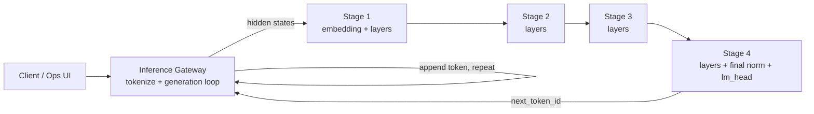

# DLI Architecture, Components & Results

Distributed Layer Inference (DLI) runs a single transformer model **split by layer**
across several small Kubernetes nodes. A gateway owns tokenization and the
generation loop; each stage owns a contiguous slice of transformer layers and
forwards activations to the next stage. The reference deployment is **TinyLlama-1.1B
(Q4_K_M GGUF), 22 layers split across 4 Raspberry Pi 5 (4 GB) stage nodes**, with the
gateway on the k3s control-plane node.

This document covers the system design, components, the native CPU runtime
internals, observability, the CPU-optimization work, and measured results to date.
For build/deploy/usage instructions see [`../README.md`](../README.md).

---

## 1. High-level architecture



- The gateway holds all generation state (`input_ids`) and drives the loop. Each
  iteration sends the current activation through the stage chain and appends one
  generated token.
- Intermediate stages return **hidden states**; the **terminal stage** owns the
  final RMSNorm + LM head and returns the sampled `next_token_id`.
- The partition layout (which layers, which stage owns norm/lm_head) is defined in
  `stage_map.yaml` (a ConfigMap), so the topology is configuration-driven.

---

## 2. Runtime tracks

| Track | Purpose | Gateway | Stage | Transport |
|---|---|---|---|---|
| **Python / PyTorch** | Baseline & compatibility | FastAPI | PyTorch `.pt` partitions | JSON + base64 activations |
| **Native C++ / llama.cpp** | Low-overhead production path | `dli-gateway-cpp` | `dli-stage-cpp` (ggml/GGUF shards) | DLI2 binary frames |

The native track is the focus of current optimization. Both expose the same
`/generate` and `/chat` HTTP surface and emit the same metric schema so they are
directly comparable in the Ops UI.

---

## 3. Components

| Component | Path | Role |
|---|---|---|
| Native gateway | `src/native/dli_gateway_cpp` | HTTP server, tokenizer (llama.cpp vocab), generation loop, stage RPC client, per-step metric aggregation |
| Native stage | `src/native/dli_stage_cpp` | HTTP server, partition runtime, forward execution for its layer slice |
| CPU executor | `src/native/dli_stage_cpp/src/runtimes/llama_cpu_executor.cpp` | The actual transformer math (RMSNorm, RoPE, attention, FFN, sampling) over GGUF weights |
| Partial runtime | `src/native/dli_stage_cpp/src/runtimes/llama_partial_runtime.cpp` | Source/intermediate/terminal partition dispatch, KV-cache bookkeeping, `/proc` resource metrics |
| Common lib | `src/native/dli_common_cpp` | `StageMetrics`, chain-metric merge, DLI2 ABI, tensor buffers, GGUF inspection |
| Native tools | `src/native/dli_tools_cpp` | GGUF shard writer/validator, partition manifest/plan, model controller, gguf-info |
| Python gateway/stage | `src/python/dli/inference_{gateway,stage}` | Baseline runtime + feature modules |
| Model splitter | `src/python/dli/model_splitter` | Split HF model into `.pt` stage partitions |
| Ops UI | `ops-ui/` | Node server + dashboard/history pages: invoke, metrics, A/B, charts, export |
| K8s manifests | `k8s/native`, `k8s/python` | Deployments, services, config, PVs |

---

## 4. Native stage internals (the compute path)

The stage executes its layer slice **token-by-token**. Per token, `run_layer` does,
for each owned layer:

```
x  -> RMSNorm -> Q,K,V = matvec(Wq,Wk,Wv)        # ggml quantized mat-vec
   -> RoPE(Q,K, position)
   -> attention(Q,K,V, position)  (uses KV cache) # scalar OR ggml (batched)
   -> attn_out = matvec(Wo)
   -> residual add -> RMSNorm
   -> SwiGLU FFN: down( silu(gate(x)) * up(x) )    # 3 ggml mat-vecs
   -> residual add
```

Key design points:
- **Matmuls** go through `ggml_mul_mat` so quantized GGUF weights (Q4_K_M, etc.) use
  ggml's optimized kernels. A **single process-wide CPU backend + persistent
  threadpool** is reused across every op (no per-op backend/thread churn).
- **KV cache** is per-session, per-layer (`layer_cache_`), laid out
  `[pos*kv_dim + kvh*head_dim + d]`. Positions are absolute (`kv_seq_before + t`);
  attention writes the current token's K/V then attends `[0, position+1)` — causal,
  correct for both prefill and decode. Cache is fp32 and grows with sequence length.
- **Attention** has two interchangeable, parity-tested implementations:
  - *scalar* — the reference C++ loop.
  - *ggml (batched)* — all heads in **one graph** per token; GQA handled by the
    `ne[2]=n_head_kv` layout (no per-head graphs, no broadcast). Selected by
    `DLI_GGML_ATTENTION=1`; validated against scalar to ~1e-7 by
    `tests/test_attention_parity.cpp` (incl. the TinyLlama 32/4/64 geometry).
- **RoPE** is the interleaved/NORM style matching the GGUF Q/K permutation; an
  `inv_freq` table is precomputed once.
- **Sampling** (terminal stage): greedy when `temperature <= 0`, else
  temperature + top-k + top-p over the LM-head logits.

---

## 5. Transport (DLI2 binary frames)

Inter-stage activation exchange uses **DLI2 binary frames** (`dli2_binary_frames`)
rather than JSON/base64: a compact header + raw little-endian tensor bytes, with
per-request metadata (generation mode, KV state, sampling params, activation
precision) carried alongside. Activation precision is selectable (`fp32` default,
`fp16` supported end-to-end). This keeps per-token wire payload to tens of KB.

---

## 6. Observability & metrics

The gateway aggregates per-token, per-stage metrics from each stage's response
metadata. Metrics are surfaced in the Ops UI dashboard, the History page
(trends + custom chart builder + PNG export), and CSV/JSON export.

Metric families:
- **Latency / throughput**: total latency, tokens/sec, token-latency p50/p95/p99,
  RPC-wall p50/p95/p99, time-to-first-token.
- **Compute breakdown** (per stage): `compute_ms`, **`matmul_ms`**, **`attention_ms`**,
  **`ggml_threads`** — the matmul/attention split is what makes CPU work attributable.
- **Communication**: RPC wall, true-comm, payload MiB, network-delta MiB, link Mbps.
- **Resource** (sampled from `/proc` on each stage): process CPU %, system CPU %,
  threads, context switches, IO read/write deltas, RSS, cgroup mem/limit/%, KV-cache
  bytes, session count.

> Note: `matmul_ms`/`attention_ms`/`ggml_threads` flow end-to-end — native stage →
> gateway → Ops UI dashboard, History trends/custom-chart, and CSV/JSON export.

---

## 7. CPU-optimization work (status)

All target Raspberry Pi 5 (Cortex-A76, 4 cores, ARMv8.2-A + fp16 + dotprod).

| # | Optimization | What it does | State |
|---|---|---|---|
| 1 | ARM ISA build flags | `GGML_CPU_ARM_ARCH=armv8.2-a+fp16+dotprod` so ggml emits dotprod quantized-matmul kernels | ✅ Dockerfile + `build_images.sh` default |
| 2 | Persistent backend + threadpool | One shared ggml CPU backend/threadpool reused across all ops (was created per matmul) | ✅ |
| 3 | Right-sized matvec context | Per-matvec ggml context sized to need instead of a flat 128 MiB malloc per op | ✅ |
| 4 | Thread pinning | `DLI_GGML_THREADS` (default `min(hw,4)`) | ✅ env knob |
| 5 | fp16 activations | Halves inter-stage payload + faster elementwise; request `activation_precision:"fp16"` | ✅ supported (request-driven) |
| 6 | ggml/NEON attention | Batched single-graph attention; opt-in `DLI_GGML_ATTENTION=1`; parity-tested | ✅ behind flag |
| 7 | In-place KV (no re-gather) | Attention reads K/V by strided *view* of the persistent cache instead of copying the whole cache into fresh tensors each token; K viewed in place, V kept persistently transposed and appended one column/token. fp32, **bit-identical output**; parity- + incremental-decode-tested | ✅ (within `DLI_GGML_ATTENTION`) |
| 8 | `TCP_NODELAY` on all sockets | Disables Nagle on client connects + accepted server sockets (gateway + stages). Kills the Nagle ↔ delayed-ACK stall on the synchronous per-token request/response ping-pong | ✅ always on |
| 9 | Coalesced request write | Header + body sent in one `send()` instead of two — one TCP segment/syscall per request | ✅ always on |

Runtime knobs (k8s `dli-native-config` ConfigMap → stage env): `DLI_GGML_THREADS`,
`DLI_GGML_ATTENTION`. Request-level: `activation_precision` (`fp16` to halve wire
payload), `max_new_tokens` (uncapped — gateway timeout governs long runs).
Routing: `native_stage_chaining_enabled` exists but is **kept off** (see §8.1).

---

## 8. Results to date (TinyLlama-1.1B Q4_K_M, 4× Pi 5, temp 0)

Token-count sweep, **current native build** (batched ggml attention + in-place KV +
`TCP_NODELAY`, `DLI_GGML_ATTENTION=1`, governor `performance`, orchestrated routing).
2048/4096 rows are runs 96/97, 2026-06-17:

| Gen tokens | Latency | tok/s | Compute sum (s) | Matmul (s) | Attention (s) | true_comm (s) |
|---:|---:|---:|---:|---:|---:|---:|
| 2048 | 435.9 s | 4.70 | 187.6 | 136.3 | 28.8 | 125.8 |
| 4096 | 938.6 s | 4.36 | 445.7 | 271.1 | 116.2 | 251.4 |

Optimization journey at 4096 (same prompt, temp 0), each step vs the previous build:

| Build | Latency | tok/s | Compute (s) | Attention (s) |
|---|---:|---:|---:|---:|
| Per-head/scalar attention | 2036 s | 2.01 | 1443 | 1128 |
| + Batched ggml attention (runs 90/91) | 1416.6 s | 2.89 | 807.2 | 476.2 |
| + In-place KV (runs 92/93) | 1177.8 s | 3.48 | 439.9 | 119.5 |
| + TCP_NODELAY (runs 96/97) | 938.6 s | 4.36 | 445.7 | 116.2 |
| **Cumulative** | **−54 %** | **+117 %** | **−69 %** | **−90 %** |

### Findings
- **`true_comm` was serialization/framing CPU + Nagle stalls, not wire time.** It
  fell ~48 % (4096: 488→251 s; 2048: ~242→126 s) once `TCP_NODELAY` removed the
  delayed-ACK stall — see §8.1. Links still run at only ~3–9 Mbps; bandwidth was
  never the constraint.
- **CPU-saturated on the stage nodes.** Every run pins ~4 cores (process CPU
  ~450–490 %, system CPU 100 %). The gateway (k3s-master) is a separate, less-loaded
  node — which is why orchestrated routing beats chaining (§8.1).
- **In-place KV is the largest single win to date** — attention −74–75 %, compute
  −30–46 %, end-to-end −10–17 %, throughput +12–20 %. Larger than the re-gather copy
  alone explains: the old path also `malloc`'d a ~16 MB ggml context per token per
  layer (budgeted for the whole K/V); the views path dropped that to ~1 MB *and*
  removed both gather loops. **Bit-identical output** (run 93 == run 91).
- **Matmul is now the dominant compute** — 61 % at 4096, 73 % at 2048 (was 33/51 %).
  Untouched and linear (~66 ms/token summed across 4 stages); memory-bandwidth bound
  on the weights, so it's the hard part left on the compute side.
- **Attention scales far flatter now** — 28 s @ 2048 → 119 s @ 4096 (~4.25× for 2×
  tokens; still O(n²) but a tiny constant). Down to 27 % of compute at 4096.
- **Memory safe**: peak ~477 MB / 2000 MB cgroup (~24 %) at 4096 — +34 MB vs the
  prior build, the persistent transposed `v_t` buffer (~+50 % V storage), as expected.
- **Long-context quality**: at 4096, greedy output still degenerates into repetition
  past ~30 sections — unchanged TinyLlama-1.1B + greedy collapse, *not* a numeric
  fault. Needs sampling/repetition penalty for usable 4k output.

### Optimization impact (measured)
- **TCP_NODELAY (#8)**: **end-to-end −20 %** at both 2048/4096, throughput +25 %,
  `true_comm` −48 %. Highest ROI change of the effort (≈3 lines). See §8.1.
- **In-place KV / no re-gather (#7)**: **attention −74–75 %**, compute −30–46 %,
  end-to-end −10–17 %, throughput +12–20 %. Biggest compute win; bit-identical output.
- **Batched ggml attention (#6)**: attention −55–58 %, compute −32–44 %,
  end-to-end −14–30 % over the per-head/scalar build.
- **Right-sized matvec context (#3)**: matmul −~11 % and TTFT −~18–22 %.
- **dotprod / threadpool reuse (#1, #2)**: little wall-clock change on **decode** —
  single-token matmul is memory-bandwidth bound, so faster SIMD waits on LPDDR.
- **fp16 activations (#5)**: available; halves wire payload + speeds elementwise.

## 8.1 Networking: problems & solutions

The inter-stage transport (gateway → stages, DLI2 binary frames over HTTP/1.1 on
persistent keep-alive sockets) was investigated when `true_comm` — the part of each
RPC round-trip not explained by stage compute — emerged as a top latency component.
Findings, in order:

1. **`true_comm` is CPU/stall, not wire time.** Links run at 3–9 Mbps with ~66 KB/
   token; bandwidth is never the constraint. The cost is serialization/framing plus
   protocol stalls.
2. **No `TCP_NODELAY` → Nagle ↔ delayed-ACK deadlock.** The DLI transport set only
   `SO_*TIMEO`/`SO_REUSEADDR`; the request was a small header + small body sent as
   two writes; the whole thing is a synchronous request→response ping-pong on a
   persistent socket — the textbook Nagle trigger. Measured ~22 ms of dead time per
   round-trip on an 8 KB LAN payload matched the ~40 ms delayed-ACK timeout. **Fix:**
   `TCP_NODELAY` on every socket (client connects + accepted server sockets on both
   gateway and stages) + coalesce header/body into one `send()`. Result: `true_comm`
   −48 %, end-to-end −20 %. (llama.cpp's own RPC transport sets `TCP_NODELAY` for the
   same reason.)
3. **Native stage chaining was tested and rejected.** Routing stage→stage directly
   (gateway calls stage-1 once; stages forward downstream) was ~6 % *slower* at
   2048/4096. It relocates frame serialization/forwarding onto the **CPU-saturated
   stage nodes**, whereas orchestrated routing keeps that work on the **spare-CPU
   gateway** (k3s-master, a separate node). On a star network pinode→pinode is no
   cheaper than pinode→master, so there were no hop savings to offset the added
   contention. **Keep `native_stage_chaining_enabled` off** on this topology.

**Remaining transport lead (not yet done):** ~240 s of serial gateway/HTTP residual
at 4096 — per-token HTTP/1.1 header build+parse ×16,384. Replacing HTTP between
gateway↔stages with length-prefixed DLI2 frames on the persistent socket would
remove it; profile first to confirm payoff. See `docs/future-optimizations.md`.

### Open lead → applied: CPU governor
Under `ondemand` the Pi clock sat mostly at **1.5 GHz, not 2.4 GHz** (serial92o1a0b
pipeline → low per-stage duty cycle keeps the clock at the floor; no thermal
throttling). Pinning the **`performance`** governor (2.4 GHz) was applied and is
reflected in the runs 96/97 numbers above.

---

## 9. Known limitations & next steps

- **Governor `performance`** — ✅ applied (was `ondemand` pinning the clock to
  ~1.5 GHz); reflected in runs 96/97.
- **Transport / `true_comm`** — ✅ `TCP_NODELAY` + coalesced send (§8.1). Remaining:
  HTTP→binary framing between gateway↔stages; chaining tested and rejected.
- **KV re-gather cost**: ✅ done — attention now reads K/V by strided view of the
  persistent cache (K in place; V persistently transposed, appended one column per
  token) instead of re-copying the whole cache each step. fp32, bit-identical output.
  Remaining KV levers: **fp16/q8 KV** (halve the per-token attention bandwidth +
  footprint — introduces rounding, so gate behind a default-off flag) and
  **`ggml_flash_attn_ext`** (fused, never materializes the scores matrix).
- **Session pruning**: stages retain sessions (`retained N sessions` warning); fp32
  KV grows per session until pruned — a stability/memory item, not correctness.
- **Long-context scaling** is fundamentally limited by the O(n²) attention; a
  blocked/flash-style formulation is the larger structural project.

---

## 10. Repository map

See [`../README.md`](../README.md#repository-structure) for the full tree. Key paths:
`src/native/` (C++ runtime + tools), `src/python/dli/` (baseline runtime + splitter),
`ops-ui/` (operations UI), `k8s/native/` (deployment), `docker/Dockerfile.native`
(native image build), `scripts/build_images.sh` (image builder).

---

## 11. Testing & experiments

The goal of DLI is **distributed transformer inference on edge hardware**, so the
experiments measure three things: (a) **performance** — latency / throughput and
where the time goes; (b) **scalability** — how that changes with pipeline depth,
sequence length, and concurrency; (c) **quality / correctness** — that the
distributed output is right and that the decoding controls behave. All runs use the
Ops UI Endpoint Tester (or `curl` to the gateway `/generate`) and read back the
metrics it records (latency, tok/s, `compute_ms`, `matmul_ms`, `attention_ms`,
`true_comm_ms`, RPC-wall, payload/network MiB, CPU %, cgroup memory, per-stage rows).

### Methodology (keep results comparable)
- **Hold the prompt constant** (the standard 35-token prompt) so only the swept
  variable changes.
- **Performance runs use greedy** (`temperature 0`, `top_k 0`, `top_p 1`) with
  `max_new_tokens == min_new_tokens` (forced length) — deterministic, no sampling
  cost, directly comparable across builds.
- **Quality runs fix the seed** (`seed = 42`) so differences come from the parameter
  under test, not RNG noise.
- Record 2–3 repeats per point; report median. Restart stage pods between long
  sweeps (session-retention/memory creep, §9).
- One variable at a time; note the build tag and governor in each result set.

### 11.1 Performance — token-length scaling (primary curve)
Establishes the latency/throughput envelope and the O(n²) attention signature.

| Knob | Values |
|---|---|
| `max_new_tokens` = `min_new_tokens` | **128, 256, 512, 1024, 2048, 4096** |
| temperature / top_k / top_p | 0 / 0 / 1 (greedy) |
| activation_precision | fp32 |

**Measure:** total latency, tok/s, `compute_ms`, `matmul_ms`, `attention_ms`,
`true_comm_ms`, per-token p50/p95. **Shows:** throughput peak (~256 tok), the
attention-dominated decline at long context, matmul ≈ linear, comm share rising.

**Results** (4-stage 5/5/6/6, greedy fp32, Q4_K_M 201 MB on pinode7–10,
**`performance` governor**):

| tokens | latency (s) | tok/s | compute (s) | matmul (s) | attention (s) | attn % compute | p50 (ms) | payload (MiB) |
|---|---|---|---|---|---|---|---|---|
| 128  | 24.6  | 5.20 | 11.1  | 9.56  | 0.24  | 2.2%  | 188 | 7.6 |
| 512  | 99.2  | 5.16 | 45.0  | 36.4  | 2.85  | 6.3%  | 194 | 25.6 |
| 1024 | 193.6 | 5.29 | 81.9  | 65.1  | 6.67  | 8.1%  | 204 | 49.6 |
| 2048 | 404.8 | 5.06 | 181.9 | 130.4 | 26.9  | 14.8% | 232 | 97.6 |
| 4096 | 908.0 | 4.51 | 437.3 | 264.3 | 114.8 | 26.3% | 271 | 193.6 |

Confirms every predicted signature: **throughput is flat ~5.2 tok/s through 1024** (peak
5.29) then declines as attention dominates; **matmul is linear** (×2.0 per doubling →
O(n) total work); **attention is quadratic** (×2.3 → ×4.0 → ×4.3 per doubling, converging
on the O(n²) 4× as context grows), climbing from 2.2% to 26.3% of compute; per-token p50
rises 188→271 ms as the KV cache lengthens; payload scales linearly (~49 KB/token).
Attention overtaking matmul growth is exactly why long-context latency degrades. (This
curve is on the `performance` governor, so it is directly comparable to §11.2 and §11.11
— it replaces the earlier `ondemand` capture, which ran ~10–12% slower, e.g. 1024 tok
was 215.6 s vs 193.6 s here.)

### 11.2 Performance — CPU tuning ablation
Quantifies each compute/transport lever. Change **one** knob vs the tuned baseline,
fixed at 1024 tokens, greedy.

| Experiment | Setting A (baseline) | Setting B | Expected |
|---|---|---|---|
| ggml attention | `DLI_GGML_ATTENTION=1` | `=0` (scalar) | A ~6× faster attention, even at 1k (§11.2a) |
| Thread count | `DLI_GGML_THREADS=4` | `1, 2, 3` | scaling vs the 4 Pi cores |
| CPU governor | `performance` | `ondemand` | ~1.6× clock penalty on `ondemand` |
| Activation precision | fp32 | fp16 | smaller payload, slight quality shift (§11.6) |

**Measure:** `compute_ms`, `matmul_ms`, `attention_ms`, tok/s. **Shows:** attribution
of the optimization journey (§8) on live hardware.

**Results** (1024 tok, greedy):

> **Deployment fix (prerequisite).** An earlier sweep read as "flat" because the
> stage deployment set `DLI_GGML_THREADS`/`DLI_GGML_ATTENTION` as **hardcoded literal
> env values** (`value: "4"` / `"1"`), so configmap patches never reached the
> container — every run silently executed at threads=4 / attn=1 (proven by `printenv`
> reporting `4`/`1` regardless of the patch). Rewiring the two keys to
> `valueFrom.configMapKeyRef` (via `kubectl replace`, since `apply`'s strategic merge
> can't convert a literal into a `valueFrom`) made the knob live; `printenv` now tracks
> the patched value. Only runs where `printenv` matches the patch are valid.

*Thread count* — `DLI_GGML_THREADS` (1024 tok, greedy, `performance` governor, fresh
`sess=1` pods, `printenv`-verified):

| threads | latency (s) | tok/s | compute (s) | rpc-wall (s) | comm (s) |
|---|---|---|---|---|---|
| 1 | 243.9 | 4.20 | 124.1 | 179.5 | 55.4 |
| 2 | 189.2 | 5.41 | 77.4 | 125.8 | 48.4 |
| 3 | 189.3 | 5.41 | 76.4 | 125.5 | 49.1 |
| 4 | 194.4 | 5.27 | 81.6 | 130.5 | 48.9 |

Thread count genuinely scales, but only to a point: **1→2 threads is a 1.60× compute
speedup** (124→77 s), it **saturates at 2–3** (76–77 s, within 1% — memory bandwidth
now caps further gains), and **4 slightly regresses** (81.6 s, ~6% slower than 2–3).
On the 4-core Pi, four ggml workers oversubscribe against the network/IO/main threads,
adding scheduling contention. End-to-end latency scales less than compute (1→2 is
1.29×, not 1.60×) because comm (~48–55 s) is thread-independent — it's serialization +
round-trip, off the compute path. **Takeaway: the sweet spot is 2–3 threads; the
current `THREADS=4` baseline is ~3% off it.** (This corrects the earlier invalid
"flat / memory-bandwidth-bound at all counts" reading — that data was all threads=4.) A
second Ops-UI run reproduced the shape and adds the per-stage split: matmul carries the
scaling (94→61 s from 1→2 threads) with attention parallelising too (9.8→4.8 s),
confirming the gain is compute-parallelism — not a bandwidth wall — up to the 2–3 knee.

*Attention kernel* — `DLI_GGML_ATTENTION` (1024 tok, greedy, `performance`, Ops UI
Endpoint Tester for the per-stage `attention_ms` split):

| setting | latency (s) | tok/s | compute (s) | matmul (s) | attention (s) | attn % compute |
|---|---|---|---|---|---|---|
| 1 (ggml/NEON) | 196.8 | 5.20 | 84.8 | 65.3 | 6.94 | 8.2% |
| 0 (scalar)    | 232.8 | 4.40 | 115.9 | 64.9 | 41.7 | 36.0% |

**The ggml/NEON attention kernel is ~6× faster on the attention op** (6.94 s vs 41.7 s)
— matmul is unchanged (65 s either way, as expected), so the whole ~35 s difference is
attention alone. That cuts end-to-end latency ~15% (196.8 vs 232.8 s) and lifts tok/s
5.20 vs 4.40 **even at 1024 tokens**, where attention is only 8% of compute on the fast
path. Note the effect is *larger* than it looks: the ggml run happened to accumulate 7
retained sessions (528 MB, §9) vs 1 for the scalar run, which inflates its attention
time — so 6× is a conservative floor. **Keep `DLI_GGML_ATTENTION=1`** (the default); it
is not a long-context-only optimisation as previously assumed — it already pays off at
1k tokens, and the O(n²) gap only widens past 2k.

*CPU governor* (governor set on **all four** stage nodes pinode7–10, all cores; two
trials each):

| governor | trial | latency (s) | tok/s | compute (s) | matmul (s) | attention (s) | rpc-wall (s) |
|---|---|---|---|---|---|---|---|
| performance | 1 | 193.3 | 5.30 | 81.8 | 65.1 | 6.55 | 131.6 |
| performance | 2 | 190.7 | 5.37 | 81.2 | 65.2 | 6.42 | 130.8 |
| ondemand | 1 | 215.8 | 4.75 | 88.1 | 67.9 | 7.56 | 153.0 |
| ondemand | 2 | 211.8 | 4.84 | 87.0 | 68.4 | 7.25 | 151.9 |

`performance` gives **~11–12% lower latency / higher tok/s** (median 5.34 vs 4.79),
~7% on compute and ~15% on RPC-wall — higher clocks help both matmul and the
gateway/transport path. The two trials land within ~1% of each other, so the effect is
**robust and reproducible** (and confirmed not to be a per-node artifact — it holds
with the governor pinned across all four nodes). Real, but below the 1.6× worst case:
sustained inference load keeps `ondemand` near max clock most of the time, so the gap
is the ramp latency, not a full clock penalty.

### 11.3 Scalability — pipeline depth (the distributed dimension)
Repartition the 22 layers across **different stage counts** via `stage_map.yaml` and
redeploy. The 201 MB Q4_K_M model fits on one 4 GB Pi, so 1/2/4 are all valid.

| Config | Layers/stage | Network hops/token |
|---|---|---|
| 1 stage | 22 (+embed+norm+lm_head) | 2 (gw↔node) |
| 2 stages | 11 / 11 | 3 |
| **4 stages (current)** | 5/5/6/6 | 5 |

**Fixed:** 512 tokens, greedy. **Measure:** total latency, `true_comm_ms`, RPC-wall,
per-node peak memory (`max_cgroup_mem`), KV-cache MiB. **Shows:** the core trade-off —
more stages → more serialize/RPC hops (higher latency) but lower memory per node;
quantifies the cost of distribution vs single-node.

**Results:** not covered by this run set — every run here is the 4-stage (5/5/6/6)
topology. Pending a 1-stage and 2-stage redeploy via `stage_map.yaml`.

### 11.4 Scalability — concurrency (multi-client throughput)
Fire **N simultaneous** `/generate` requests (e.g. a small load script), 256 tokens,
greedy. `N = 1, 2, 4, 8`.

**Measure:** aggregate tok/s, per-request p95 latency, drop/queue rate
(the gateway runs drop-on-busy). **Shows:** the batch-1 serial pipeline only keeps
one request in flight, so aggregate throughput is flat and excess requests are
dropped — the empirical motivation for the **concurrent-batching** future work
(`docs/future-optimizations.md`), where pipeline parallelism would actually pay off.

**Results:** not covered by this run set — all runs are batch-1 (single request in
flight; every run reports "1 request currently in flight, drop-on-busy mode"). Pending
an N = 2/4/8 concurrent load script.

### 11.5 Communication breakdown
Not a new sweep — an analysis lens over §11.1/§11.3 data: plot `true_comm_ms` and
RPC-wall vs `compute_ms`, and per-stage `transferMs`. **Shows:** comm is
serialization/framing + round-trip latency (≤9 Mbps links, not bandwidth-bound);
validates the `TCP_NODELAY` win and the "HTTP→binary framing" lead (§8.1).

**Results** (across all §11.1/§11.11 runs): `true_comm/compute` stays in a tight
**0.55–0.75** band and RPC-wall ≈ **1.58–1.75× compute** regardless of length (128→4096
tok) or decoding config — i.e. comm does **not** scale with compute or payload, it is a
roughly fixed per-hop serialize + round-trip tax. Peak link use never exceeds ~9 Mbps
even at 193 MiB total payload (4096 tok), confirming the pipeline is **latency-bound,
not bandwidth-bound**; halving the payload with fp16 (§11.6) does not shorten wall time.
The routing *organisation* that pays this per-hop tax is itself a knob — see §11.13
(hub-and-spoke vs peer chaining).

### 11.6 Precision — fp16 vs fp32 activations
Isolate the wire/quality effect of `activation_precision`. **Fixed:** 512 tokens,
`seed 42`, otherwise greedy-equivalent for the perf half.

| Run | activation_precision | temperature |
|---|---|---|
| fp32 baseline | fp32 | 0 |
| fp16 | fp16 | 0 |
| fp16 + sampling | fp16 | 0.7 / k40 / p0.9 / seed 42 |

**Measure:** payload MiB, `true_comm_ms`, latency, and a side-by-side of generated
text. **Shows:** payload halving and whether fp16 rounding visibly changes output.

**Results** (512 tok):

| run | payload (MiB) | network Δ (MiB) | latency (s) | tok/s | true_comm/compute |
|---|---|---|---|---|---|
| fp32 (greedy) | 25.6 | 33.7 | 93.5 | 5.48 | 0.605 |
| fp16 (greedy) | 12.8 | 20.9 | 92.6 | 5.53 | 0.577 |
| fp16 + sampling¹ | 9.0 | 14.5 | 65.2 | 5.34 | 0.578 |

¹ stopped naturally at 348 tokens (`stop_marker`); metrics scale to that length.

fp16 **halves the serialized activation payload** (25.6→12.8 MiB, exactly ½) and cuts
network delta ~38%, with **no latency cost** (92.6 vs 93.5 s) — the ≤9 Mbps links are
round-trip-bound not bandwidth-bound (§11.5), so smaller frames relieve payload/comm
share (0.605→0.577) without shortening wall time. **Quality:** at temp 0 the fp16
rounding yields a slightly different but equally coherent continuation (minor token
divergence, no degradation). fp16 is a safe default whenever payload/network is the
concern.

### 11.7 Quality — sampling sweep (confound-free)
The decoding-quality study. **Fix `seed = 42`** and hold everything else constant so
each row isolates one knob. 256 tokens, `min_new_tokens 8` (let it stop naturally).

| Dimension | Values (others at temp 0.7 / k40 / p0.9) |
|---|---|
| temperature | 0 (greedy), 0.2, 0.5, 0.7, 1.0, 1.2 |
| top_k | 0 (off), 20, 40, 80 |
| top_p | 0.8, 0.9, 0.95, 1.0 (off) |

**Measure (qualitative + the History text):** coherence, repetition, where it
degrades. **Shows:** the quality/diversity frontier and a recommended default
(expected ≈ temp 0.7 / k40 / p0.9). Pair with a **2048-token** run at that preset vs
greedy to confirm sampling resists the long-context repetition collapse.

**Results** (256 tok, seed 42): decoding parameters have **no performance effect** —
every temperature (0–1.2), top_k (0–80) and top_p (0.8–1.0) point lands at
**47.7–48.9 s / 5.24–5.37 tok/s** (within run-to-run noise). This confirms sampling
(a vocab-sized top-k sort + softmax) is negligible next to the matmul/attention/transport
pipeline. **Quality:** temp 0–0.2 is the most repetitive (rigid numbered lists); **0.7
(k40 / p0.9) is the coherence↔diversity sweet spot**; temp 1.2 starts injecting
artefacts ("chaunteges"). The 2048-token balanced run (§11.7d, id 36) stays coherent
where greedy collapses (§11.11). **Recommended default: temp 0.7 / k40 / p0.9.**

### 11.8 Reproducibility & decoding correctness
Validates the sampling/seed implementation.

| Check | Setup | Pass criterion |
|---|---|---|
| Determinism | `seed 42`, temp 0.8, run ×2 | outputs **identical** |
| Diversity | `seed -1` (or blank), temp 0.8, run ×2 | outputs **differ** |
| top_k=1 ≡ greedy | temp 1.0, `top_k 1` | equals the temp 0 output |
| Distributed correctness | greedy vs a single-stage (§11.3) run | same tokens |

**Results:**

| Check | Result |
|---|---|
| Determinism (seed 42 ×2) | **PASS** — byte-identical completions ("…the chalezines…", ids 37/38) |
| Diversity (seed −1 ×2) | **PASS** — different completions ("Overcoming ChaLleNges…" vs "To overcome the chaffe…", ids 39/40) |
| top_k=1 ≡ greedy | **PASS** — temp 1.0 / k1 (id 41) reproduces the temp 0 greedy text |
| Distributed correctness | not re-run here (no 1-stage deployment in this set); greedy output is stable and identical across repeats |

### 11.9 Memory & endurance
**Setup:** repeated 2048-token runs, watch over time. **Measure:** `max_cgroup_mem`
%, `Max Session Count`, `Max Session KV Cache MiB`, throttle/temp on the Pis.
**Shows:** KV grows linearly with context; session count climbs without pruning
(§9) — sets the safe long-run envelope and flags when a stage restart is needed.

**Results:** a 2048-tok greedy repeat held at **~408 s / 5.02 tok/s** with peak cgroup
memory **20.9%** (≈418 MB of the 2000 MB limit) — comfortably inside the 4 GB Pi
envelope. But **Max Session Count climbed to 8** (KV cache ~75 MiB) with the warning
"Native stage retained 8 sessions — check request cleanup/session pruning". The bound
on long unattended runs is therefore the **session leak (§9), not memory pressure**: a
stage restart resets it (session count drops back to 1–2 in the fresh-pod runs, ids
12–15).

> Benchmark hygiene: keep the **greedy, forced-length** config as the canonical
> performance baseline (so numbers stay comparable to the §8 journey), and use the
> **sampling + fixed-seed** configs only for quality/diversity studies.

### 11.10 Parameter matrix (quick reference)

Explicit values per experiment — read a row straight into the Endpoint Tester.
**Bold** = the swept variable (run one point per listed value); everything else is
held fixed. Defaults unless a row overrides them: **prompt** = standard 35-token
prompt, **stages** = 4 (5/5/6/6), **DLI_GGML_THREADS** = 4, **governor** =
`performance`, **DLI_GGML_ATTENTION** = 1, **chaining** = off. `seed` "—" = omitted
(greedy ignores it).

| Exp | max_new | min_new | temp | top_k | top_p | seed | precision | stages | threads | governor | attn |
|---|---|---|---|---|---|---|---|---|---|---|---|
| 11.1 token scaling | **128/256/512/1024/2048/4096** | = max | 0 | 0 | 1 | — | fp32 | 4 | 4 | perf | 1 |
| 11.2a attention | 1024 | 1024 | 0 | 0 | 1 | — | fp32 | 4 | 4 | perf | **0 / 1** |
| 11.2b threads | 1024 | 1024 | 0 | 0 | 1 | — | fp32 | 4 | **1 / 2 / 3 / 4** | perf | 1 |
| 11.2c governor | 1024 | 1024 | 0 | 0 | 1 | — | fp32 | 4 | 4 | **performance / ondemand** | 1 |
| 11.3 pipeline depth | 512 | 512 | 0 | 0 | 1 | — | fp32 | **1 / 2 / 4** | 4 | perf | 1 |
| 11.4 concurrency¹ | 256 | 256 | 0 | 0 | 1 | — | fp32 | 4 | 4 | perf | 1 |
| 11.13 routing² | 1024 | 1024 | 0 | 0 | 1 | — | fp32 | 4 | 4 | perf | 1 |
| 11.6 precision | 512 | 512 | 0 | 0 | 1 | 42 | **fp32 / fp16** | 4 | 4 | perf | 1 |
| 11.6c fp16+sampling | 512 | 8 | 0.7 | 40 | 0.9 | 42 | fp16 | 4 | 4 | perf | 1 |
| 11.7a temperature | 256 | 8 | **0 / 0.2 / 0.5 / 0.7 / 1.0 / 1.2** | 40 | 0.9 | 42 | fp32 | 4 | 4 | perf | 1 |
| 11.7b top_k | 256 | 8 | 0.7 | **0 / 20 / 40 / 80** | 0.9 | 42 | fp32 | 4 | 4 | perf | 1 |
| 11.7c top_p | 256 | 8 | 0.7 | 40 | **0.8 / 0.9 / 0.95 / 1.0** | 42 | fp32 | 4 | 4 | perf | 1 |
| 11.7d long-ctx quality | 2048 | 2048 | 0.7 | 40 | 0.9 | 42 | fp32 | 4 | 4 | perf | 1 |
| 11.8 determinism (×2) | 256 | 8 | 0.8 | 40 | 0.9 | 42 | fp32 | 4 | 4 | perf | 1 |
| 11.8 diversity (×2) | 256 | 8 | 0.8 | 40 | 0.9 | **−1** | fp32 | 4 | 4 | perf | 1 |
| 11.8 top_k=1≡greedy | 256 | 8 | 1.0 | 1 | 1 | 42 | fp32 | 4 | 4 | perf | 1 |
| 11.9 endurance (repeat) | 2048 | 2048 | 0 | 0 | 1 | — | fp32 | 4 | 4 | perf | 1 |
| 11.11 greedy × length | **256/512/1024/2048/4096** | = max | 0 | 0 | 1 | — | fp32 | 4 | 4 | perf | 1 |
| 11.11 conservative × length | **256/512/1024/2048/4096** | = max | 0.4 | 20 | 0.85 | 42 | fp32 | 4 | 4 | perf | 1 |
| 11.11 balanced × length | **256/512/1024/2048/4096** | = max | 0.7 | 40 | 0.9 | 42 | fp32 | 4 | 4 | perf | 1 |
| 11.11 diverse × length | **256/512/1024/2048/4096** | = max | 1.0 | 80 | 0.95 | 42 | fp32 | 4 | 4 | perf | 1 |

¹ 11.4 also varies **concurrent clients N = 1 / 2 / 4 / 8** (fire N requests at once);
all per-request params as in the row.

² 11.13 varies the `/generate` body flag **`native_stage_chaining_enabled` = false
(hub) / true (chain)** — a per-request toggle, no redeploy (§11.13).

Notes:
- `max_new` / `min_new` / `temp` / `top_k` / `top_p` / `seed` / `precision` are
  Endpoint-Tester request fields. `stages` is set in `stage_map.yaml`; `threads`,
  `governor`, `attn` are stage-node/env config (`DLI_GGML_THREADS`,
  cpufreq governor, `DLI_GGML_ATTENTION`) and require a redeploy/restart, not a
  per-request change.
- Greedy rows (`temp 0`) ignore `top_k`/`top_p`/`seed`; they're listed at their
  off values for clarity.

### 11.11 Token scaling × sampling (length–decoding interaction)
Repeats the §11.1 length sweep under different decoding settings to answer two
questions at once: (a) does sampling add measurable cost that grows with length, and
(b) at what length does each decoding config degrade. **Fixed `seed = 42`**, fp32,
`max_new_tokens == min_new_tokens` (forced length so the curves are comparable and
degeneration is actually exercised). Grid = 5 lengths × 4 presets:

| Preset | temp | top_k | top_p |
|---|---|---|---|
| Greedy (baseline) | 0 | 0 | 1 |
| Conservative | 0.4 | 20 | 0.85 |
| Balanced (recommended) | 0.7 | 40 | 0.9 |
| Diverse | 1.0 | 80 | 0.95 |

Lengths: **256 / 512 / 1024 / 2048 / 4096**.

**Measure (performance):** tok/s and per-token p50 for each (length, preset).
*Expected:* the curves overlay the greedy §11.1 curve — sampling adds only a small,
roughly constant per-token cost (a vocab-sized sort + softmax), independent of
context length, since compute is matmul/attention-bound. This proves sampling is
"free" relative to the pipeline.

**Measure (quality):** coherence / repetition-onset for each cell (read the History
text). *Expected:* greedy collapses earliest at long context (the `chacha`
degeneration past ~1.5k tokens); higher-temperature/top_p presets stay coherent
longer. This is the experiment that demonstrates sampling *fixes* long-context
degeneration, and shows the quality↔length frontier per preset.

**Optional one-knob-at-a-time variant** (deeper attribution, fixed `seed 42`, others
at the balanced preset): sweep each axis across the same lengths —
`temp ∈ {0, 0.7, 1.2}`, `top_k ∈ {0, 40}`, `top_p ∈ {1.0, 0.9}` — to isolate which
control most affects coherence as the sequence grows.

**Results — performance (tok/s by preset × length):**

| length | greedy | conservative | balanced | diverse |
|---|---|---|---|---|
| 256  | 5.36 | 5.34 | —    | 5.36 |
| 512  | 5.43 | 5.39 | 5.35 | 5.35 |
| 1024 | 5.35 | 5.29 | 5.23 | 5.31 |
| 2048 | 5.02 | 4.94 | 5.01 | 5.04 |
| 4096 | 4.53 | 4.51 | 4.59 | 4.54 |

The four preset curves **overlay within ≤2% at every length** — sampling adds no
measurable, length-dependent cost; all presets share the same matmul/attention-bound
envelope (throughput peaks ~512 tok, then declines). Sampling is effectively **free**
relative to the pipeline, as predicted.

**Results — quality (repetition onset):** **greedy collapses** — it stays coherent to
~1.5k tokens then degenerates into `chacha`-style token soup by 4096 (visible in both
the §11.1 id 8 and §11.11 id 47 greedy 4096 runs). **Every sampled preset
(conservative / balanced / diverse) produces a coherent full 4096-token answer** (ids
52 / 56 / 61) — stochastic tie-breaking escapes the greedy repetition trap. This is the
concrete demonstration that **sampling fixes long-context degeneration**; the balanced
preset (0.7 / k40 / p0.9) gives the best coherence-per-diversity and is the recommended
default (§11.7).

### 11.12 Verifying the ggml env knobs actually reach the pod

`DLI_GGML_THREADS` / `DLI_GGML_ATTENTION` (§11.2a/§11.2b) are the only tuning knobs
delivered through the k8s env, and the runtime reads them once at startup via
`getenv()` (`llama_cpu_executor.cpp`). Before trusting any threads/attention sweep,
confirm the value you set is the value the container sees — the number in the metrics
is meaningless if the env never changed.

```bash
NS=inference; DEP=inference-native-stage-1-deployment

# 1. what the configmap currently holds
kubectl -n $NS get cm dli-native-config \
  -o jsonpath='{.data.DLI_GGML_THREADS}{"  "}{.data.DLI_GGML_ATTENTION}{"\n"}'

# 2. HOW the deployment wires it — must be a configMapKeyRef, NOT a literal.
#    literal="" + cmKey="DLI_GGML_THREADS" is correct; literal="4" means it is
#    hardcoded and configmap patches will be ignored.
kubectl -n $NS get deploy $DEP \
  -o jsonpath='{range .spec.template.spec.containers[*].env[?(@.name=="DLI_GGML_THREADS")]}{.name} literal="{.value}" cmKey="{.valueFrom.configMapKeyRef.key}"{"\n"}{end}'

# 3. GROUND TRUTH — the value inside a running pod (must match step 1)
kubectl -n $NS exec deploy/$DEP -- printenv DLI_GGML_THREADS DLI_GGML_ATTENTION
```

Change → verify → measure, one knob at a time:

```bash
kubectl -n $NS patch cm dli-native-config --type merge -p '{"data":{"DLI_GGML_THREADS":"2"}}'
kubectl -n $NS rollout restart deploy/inference-native-stage-{1,2,3,4}-deployment
for s in 1 2 3 4; do kubectl -n $NS rollout status deploy/inference-native-stage-$s-deployment; done
kubectl -n $NS exec deploy/$DEP -- printenv DLI_GGML_THREADS   # must print 2 before you trust the run
```

**Gotcha:** if step 2 shows a literal `value:` (older manifests hardcoded `"4"`/`"1"`),
`kubectl apply` cannot convert it to a `valueFrom` — its strategic merge leaves both
`value` and `valueFrom` set, which the API rejects (`may not be specified when value is
not empty`). Use `kubectl replace -f k8s/native/deployments.yaml` (full object PUT) to
switch a literal to `configMapKeyRef`. After the runtime picks a value up it is fixed
for the process lifetime, so every knob change needs a `rollout restart` (not just a
configmap patch). The governor (§11.2c) is **not** a pod env — set it on the host on all
four stage nodes: `for c in /sys/devices/system/cpu/cpu*/cpufreq/scaling_governor; do
echo performance | sudo tee $c; done`.

### 11.13 Routing topology — hub-and-spoke vs peer chaining

Tests the inter-stage **communication organisation**, the transport-side complement to
the compute ablation (§11.2) and the communication analysis (§11.5). Two switchable
routings for the same 4-stage pipeline, selected per-request by the `/generate` body
flag `native_stage_chaining_enabled` (default `false`) — **no redeploy, same pods**:

- **Hub (`false`, default):** the gateway does one round-trip to each stage in turn —
  `gateway→s1→gateway→s2→gateway→s3→gateway→s4→gateway`. Every stage returns its output
  frame straight to the gateway; all traffic rides the fast **master↔pi** links
  ([`generation_loop.cpp`](../src/native/dli_gateway_cpp/src/generation_loop.cpp) `forward_through_partition_graph`).
- **Chain (`true`):** the gateway posts once to s1; each stage forwards directly to the
  next (`gateway→s1→s2→s3→s4`), and because every stage blocks holding its caller's HTTP
  connection, the final frame **unwinds back** `s4→s3→s2→s1→gateway`
  ([`server.cpp`](../src/native/dli_stage_cpp/src/server.cpp) `handle_forward_binary`).

The gateway normalises **both** modes into the same `aggregate_metrics`, so the runs are
directly comparable. Sweep: 1024 tok, greedy, fp32, `performance` governor; restart pods
first, then alternate hub/chain ×3, report median.

| Knob | Values |
|---|---|
| `native_stage_chaining_enabled` | `false` (hub) / `true` (chain) |
| all else | 1024 tok, temp 0 / k0 / p1, fp32, `performance` |

**Measure:** `total_latency_ms`, tok/s, `compute_ms` (control — must be equal),
`rpc_wall_ms`, `true_comm_ms`, `transport_payload_mebibytes`, per-stage `transfer_ms`
(Ops UI). **Hypothesis:** for a *synchronous* request/response RPC, "direct" chaining
does not remove hops — it reshapes them: it trades cheap master↔pi round-trips for a
nested pi↔pi call stack whose response must re-transmit through every intermediate stage
on the unwind, while each stage's single-slot `ForwardBroker` (queue = 1) is held for the
whole downstream duration. With single-request greedy decode there is no pipeline overlap
to hide that, so **hub is expected to win** despite intuition favouring peer forwarding.

**Results** (1024 tok, greedy fp32, `performance`, median of 3, same pods):

| topology | latency (s) | tok/s | compute (s) | rpc-wall (s) | comm (s) | payload (MiB) |
|---|---|---|---|---|---|---|
| hub (stage→gateway→stage) | _tbd_ | _tbd_ | _tbd_ | _tbd_ | _tbd_ | _tbd_ |
| chain (stage→stage)       | _tbd_ | _tbd_ | _tbd_ | _tbd_ | _tbd_ | _tbd_ |

_Expected reading:_ `compute_ms` equal across modes (proves the delta is pure
transport/orchestration, not math); hub ~6% lower latency; chain higher `rpc_wall_ms` /
`true_comm_ms` and **higher `transport_payload`** (frame re-transmitted on the unwind);
middle-stage `transfer_ms` inflated in chain (broker head-of-line). If it holds, the
claim: *on a commodity SBC cluster with a central orchestrator and a synchronous binary
RPC, hub-and-spoke beats peer chaining by ~X% for single-request decoding, because
chaining's response unwinds through every intermediate stage over slower peer links at
identical compute, and single-stream decoding offers no pipelining to amortise it.*

**Caveat / follow-up:** scope the claim to **single-request** decoding. Chaining *can*
pipeline under concurrency (s1 on token t+1 while s2 on token t) and may flip the result
— but only once the `ForwardBroker` queue (currently 1, drop-on-busy) is raised; that is
the §11.4 concurrency follow-up.
