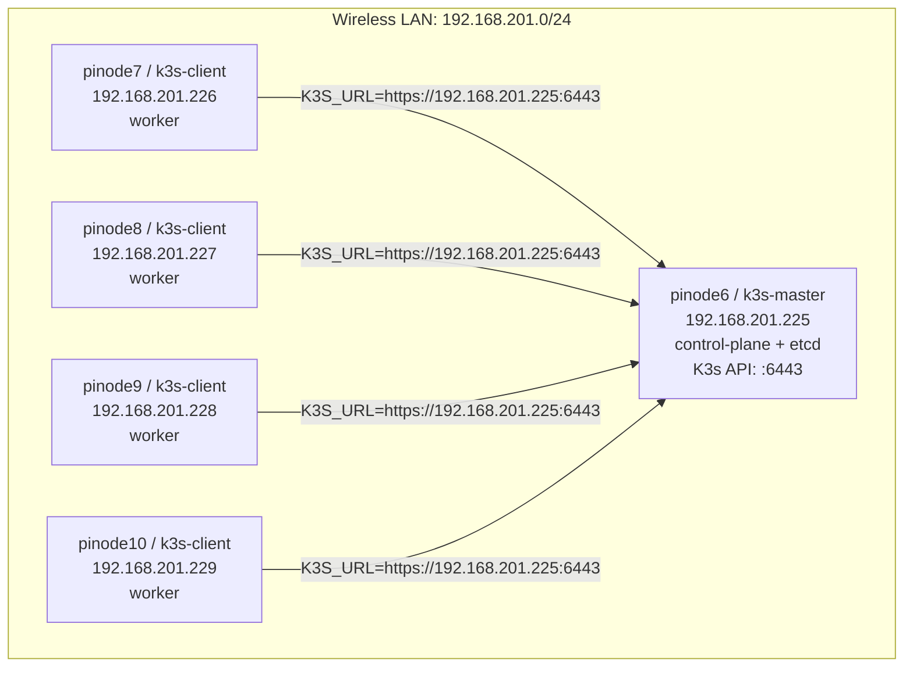

# K3s Cluster Topology

This document describes the physical and logical topology for the distributed inference K3s cluster.

## Network Summary

All nodes are connected through the wireless interface `wlan0` on the same IPv4 subnet:

```text
Subnet:    192.168.201.0/24
Broadcast: 192.168.201.255
Interface: wlan0
```

The K3s API server is exposed by the master node at:

```text
https://192.168.201.225:6443
```

## Node Inventory

| Physical Node | Linux Prompt Host | K3s Role | Interface | IPv4 Address | MAC Address | IPv6 Link Local |
|---|---|---|---|---|---|---|
| `pinode6` | `k3s-master` | Control plane + etcd | `wlan0` | `192.168.201.225/24` | `2c:cf:67:61:f1:1c` | `fe80::2ecf:67ff:fe61:f11c/64` |
| `pinode7` | `k3s-client` | Worker | `wlan0` | `192.168.201.226/24` | `2c:cf:67:61:f0:a4` | `fe80::2ecf:67ff:fe61:f0a4/64` |
| `pinode8` | `k3s-client` | Worker | `wlan0` | `192.168.201.227/24` | `2c:cf:67:61:f1:6b` | `fe80::2ecf:67ff:fe61:f16b/64` |
| `pinode9` | `k3s-client` | Worker | `wlan0` | `192.168.201.228/24` | `2c:cf:67:61:f1:d1` | `fe80::2ecf:67ff:fe61:f1d1/64` |
| `pinode10` | `k3s-client` | Worker | `wlan0` | `192.168.201.229/24` | `2c:cf:67:61:f1:e1` | `fe80::2ecf:67ff:fe61:f1e1/64` |

## Physical Topology

```text
Wireless LAN: 192.168.201.0/24

                   +-----------------------------+
                   | Wi-Fi Network / Router      |
                   | Broadcast: 192.168.201.255  |
                   +--------------+--------------+
                                  |
        +-------------------------+-------------------------+
        |                         |                         |
+-------+--------+       +--------+-------+        +--------+-------+
| pinode6        |       | pinode7        |        | pinode8        |
| k3s-master     |       | k3s-client     |        | k3s-client     |
| 192.168.201.225|       | 192.168.201.226|        | 192.168.201.227|
| control-plane  |       | worker         |        | worker         |
| etcd           |       |                |        |                |
+----------------+       +----------------+        +----------------+

        +-------------------------+-------------------------+
        |                                                   |
+-------+--------+                                  +-------+--------+
| pinode9        |                                  | pinode10       |
| k3s-client     |                                  | k3s-client     |
| 192.168.201.228|                                  | 192.168.201.229|
| worker         |                                  | worker         |
+----------------+                                  +----------------+
```

## Logical K3s Topology



## Master Node

The master node is `pinode6`, reachable on `wlan0` at:

```text
192.168.201.225/24
```

It runs:

- K3s server
- Kubernetes control plane
- Embedded etcd datastore
- Container runtime through K3s-managed containerd

The master was installed with:

```bash
sudo env INSTALL_K3S_EXEC="server --node-name k3s-master --write-kubeconfig-mode 644 --cluster-init --disable traefik --disable servicelb --flannel-backend vxlan --node-ip 192.168.201.225 --advertise-address 192.168.201.225" sh /tmp/install-k3s.sh
```

Important settings:

| Setting | Value | Purpose |
|---|---|---|
| `--node-name` | `k3s-master` | Kubernetes node name for the master |
| `--cluster-init` | enabled | Initializes the first embedded-etcd server |
| `--node-ip` | `192.168.201.225` | Internal node IP used by Kubernetes |
| `--advertise-address` | `192.168.201.225` | Address advertised to workers and clients |
| `--disable traefik` | enabled | Disables bundled Traefik ingress |
| `--disable servicelb` | enabled | Disables bundled K3s ServiceLB |
| `--flannel-backend` | `vxlan` | Uses VXLAN overlay networking for pods |

## Worker Nodes

The worker nodes are:

```text
pinode7   192.168.201.226
pinode8   192.168.201.227
pinode9   192.168.201.228
pinode10  192.168.201.229
```

Each worker should join the cluster using the master API endpoint:

```text
https://192.168.201.225:6443
```

Recommended worker join pattern:

```bash
sudo env K3S_URL="https://192.168.201.225:6443" \
K3S_TOKEN="<K3S_NODE_TOKEN>" \
INSTALL_K3S_EXEC="agent --node-name PINODE_NAME --node-ip WORKER_IP" \
sh /tmp/install-k3s.sh
```

Recommended node names:

| Physical Node | Recommended `--node-name` | `--node-ip` |
|---|---|---|
| `pinode7` | `pinode7` | `192.168.201.226` |
| `pinode8` | `pinode8` | `192.168.201.227` |
| `pinode9` | `pinode9` | `192.168.201.228` |
| `pinode10` | `pinode10` | `192.168.201.229` |

Using unique Kubernetes node names is important because all worker shell prompts show `k3s-client`. If every worker joins with the same `--node-name`, Kubernetes will treat them as the same node name and the cluster state will be incorrect.

## Expected Cluster View

After all workers join, the master should show:

```bash
sudo k3s kubectl get nodes -o wide
```

Expected layout:

```text
NAME         STATUS   ROLES                INTERNAL-IP
k3s-master   Ready    control-plane,etcd   192.168.201.225
pinode7      Ready    <none>               192.168.201.226
pinode8      Ready    <none>               192.168.201.227
pinode9      Ready    <none>               192.168.201.228
pinode10     Ready    <none>               192.168.201.229
```

## Useful Verification Commands

Run on each node to confirm the local network address:

```bash
ip addr show wlan0
hostname
hostname -I
```

Run on the master to confirm cluster health:

```bash
sudo systemctl status k3s --no-pager -l
sudo k3s kubectl get nodes -o wide
sudo k3s kubectl get pods -A
```

