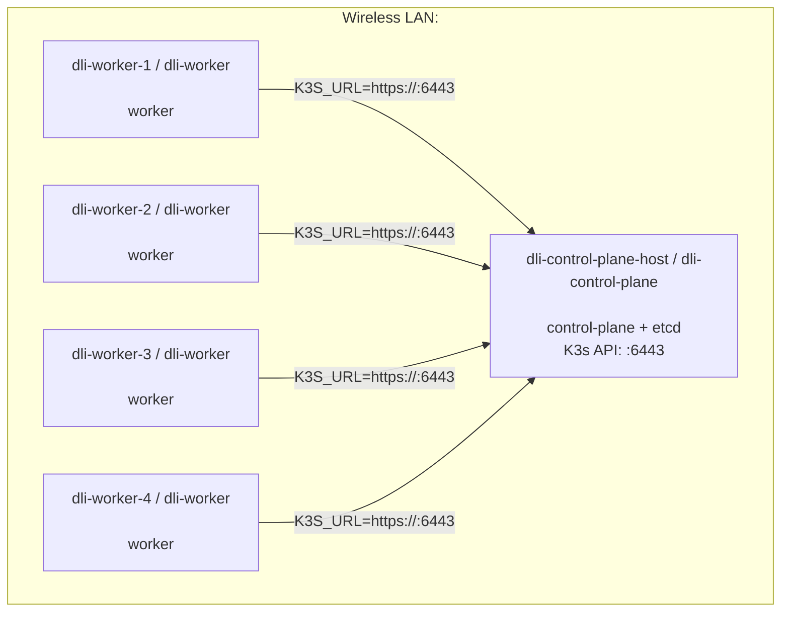

# K3s Cluster Topology

This document describes the physical and logical topology for the distributed inference K3s cluster.

## Network Summary

All nodes are connected through the wireless interface `wlan0` on the same IPv4 subnet:

```text
Subnet:    <CLUSTER_SUBNET_CIDR>
Broadcast: <CLUSTER_BROADCAST>
Interface: wlan0
```

The K3s API server is exposed by the master node at:

```text
https://<CONTROL_PLANE_IP>:6443
```

## Node Inventory

| Physical Node | Linux Prompt Host | K3s Role | Interface | IPv4 Address | MAC Address | IPv6 Link Local |
|---|---|---|---|---|---|---|
| `dli-control-plane-host` | `dli-control-plane` | Control plane + etcd | `wlan0` | `<CONTROL_PLANE_IP>/24` | `<MAC_REDACTED>` | `<IPV6_LINK_LOCAL_REDACTED>` |
| `dli-worker-1` | `dli-worker` | Worker | `wlan0` | `<WORKER_1_IP>/24` | `<MAC_REDACTED>` | `<IPV6_LINK_LOCAL_REDACTED>` |
| `dli-worker-2` | `dli-worker` | Worker | `wlan0` | `<WORKER_2_IP>/24` | `<MAC_REDACTED>` | `<IPV6_LINK_LOCAL_REDACTED>` |
| `dli-worker-3` | `dli-worker` | Worker | `wlan0` | `<WORKER_3_IP>/24` | `<MAC_REDACTED>` | `<IPV6_LINK_LOCAL_REDACTED>` |
| `dli-worker-4` | `dli-worker` | Worker | `wlan0` | `<WORKER_4_IP>/24` | `<MAC_REDACTED>` | `<IPV6_LINK_LOCAL_REDACTED>` |

## Physical Topology

```text
<CLUSTER_SUBNET_CIDR> over wlan0

[dli-control-plane]  <CONTROL_PLANE_IP>  control plane + etcd + API :6443
        |
        +-- [dli-worker-1]  <WORKER_1_IP>  stage 1
        +-- [dli-worker-2]  <WORKER_2_IP>  stage 2
        +-- [dli-worker-3]  <WORKER_3_IP>  stage 3
        `-- [dli-worker-4]  <WORKER_4_IP>  stage 4
```

## Logical K3s Topology



## Master Node

The master node is `dli-control-plane-host`, reachable on `wlan0` at:

```text
<CONTROL_PLANE_IP>/24
```

It runs:

- K3s server
- Kubernetes control plane
- Embedded etcd datastore
- Container runtime through K3s-managed containerd

The master was installed with:

```bash
sudo env INSTALL_K3S_EXEC="server --node-name dli-control-plane --write-kubeconfig-mode 644 --cluster-init --disable traefik --disable servicelb --flannel-backend vxlan --node-ip <CONTROL_PLANE_IP> --advertise-address <CONTROL_PLANE_IP>" sh /tmp/install-k3s.sh
```

Important settings:

| Setting | Value | Purpose |
|---|---|---|
| `--node-name` | `dli-control-plane` | Kubernetes node name for the master |
| `--cluster-init` | enabled | Initializes the first embedded-etcd server |
| `--node-ip` | `<CONTROL_PLANE_IP>` | Internal node IP used by Kubernetes |
| `--advertise-address` | `<CONTROL_PLANE_IP>` | Address advertised to workers and clients |
| `--disable traefik` | enabled | Disables bundled Traefik ingress |
| `--disable servicelb` | enabled | Disables bundled K3s ServiceLB |
| `--flannel-backend` | `vxlan` | Uses VXLAN overlay networking for pods |

## Worker Nodes

The worker nodes are:

```text
dli-worker-1   <WORKER_1_IP>
dli-worker-2   <WORKER_2_IP>
dli-worker-3   <WORKER_3_IP>
dli-worker-4  <WORKER_4_IP>
```

Each worker should join the cluster using the master API endpoint:

```text
https://<CONTROL_PLANE_IP>:6443
```

Recommended worker join pattern:

```bash
sudo env K3S_URL="https://<CONTROL_PLANE_IP>:6443" \
K3S_TOKEN="<K3S_NODE_TOKEN>" \
INSTALL_K3S_EXEC="agent --node-name WORKER_NAME --node-ip WORKER_IP" \
sh /tmp/install-k3s.sh
```

Recommended node names:

| Physical Node | Recommended `--node-name` | `--node-ip` |
|---|---|---|
| `dli-worker-1` | `dli-worker-1` | `<WORKER_1_IP>` |
| `dli-worker-2` | `dli-worker-2` | `<WORKER_2_IP>` |
| `dli-worker-3` | `dli-worker-3` | `<WORKER_3_IP>` |
| `dli-worker-4` | `dli-worker-4` | `<WORKER_4_IP>` |

Using unique Kubernetes node names is important because all worker shell prompts show `dli-worker`. If every worker joins with the same `--node-name`, Kubernetes will treat them as the same node name and the cluster state will be incorrect.

## Expected Cluster View

After all workers join, the master should show:

```bash
sudo k3s kubectl get nodes -o wide
```

Expected layout:

```text
NAME         STATUS   ROLES                INTERNAL-IP
dli-control-plane   Ready    control-plane,etcd   <CONTROL_PLANE_IP>
dli-worker-1      Ready    <none>               <WORKER_1_IP>
dli-worker-2      Ready    <none>               <WORKER_2_IP>
dli-worker-3      Ready    <none>               <WORKER_3_IP>
dli-worker-4     Ready    <none>               <WORKER_4_IP>
```

## Useful Verification Commands

Run on each node to confirm the local network address:

```bash
ip addr show wlan0
hostname
hostname -I
```

Run on the master to confirm cluster health:

```bash
sudo systemctl status k3s --no-pager -l
sudo k3s kubectl get nodes -o wide
sudo k3s kubectl get pods -A
```
